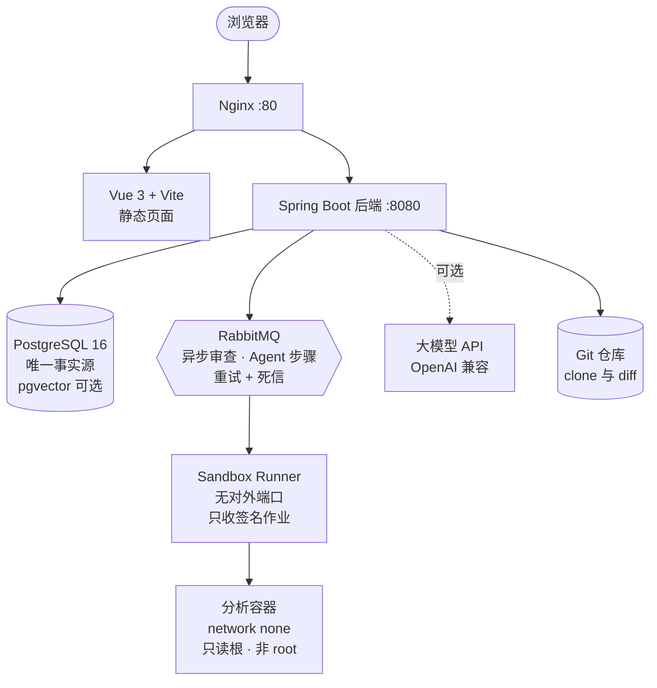
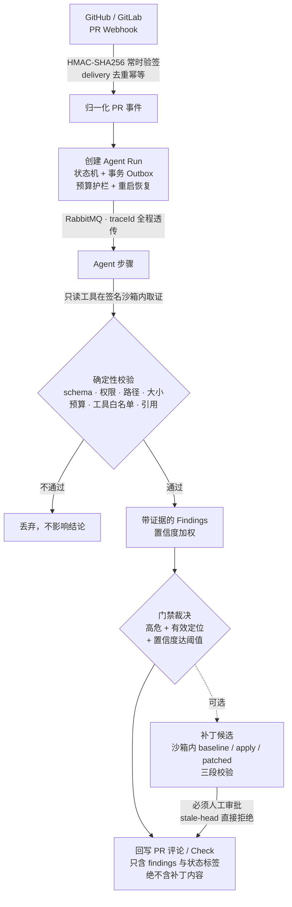

<div align="center">

# RepoSage

**把一次 Git Diff，变成一份带证据的代码审查结论**

不是"让大模型看看这段代码"，而是一条以数据库为事实源、模型输出一律先校验后采信的审查流水线。

[](https://github.com/LinYsssss/reposage/actions/workflows/ci.yml)
[](LICENSE)
[](backend/pom.xml)
[](backend/pom.xml)
[](frontend/package.json)

[快速开始](#-60-秒跑起来) · [架构](#-架构) · [PR 守门 Agent](#-pr-守门-agent) · [安全边界](#-安全边界诚实声明) · [文档](docs/README.md)

</div>

<!--
截图版位（待补，需可运行栈；本机跑不起完整栈，不放占位图冒充）
拍摄清单——建议 1440 宽、亮色、去敏感信息：
  1. hero.png        审查报告详情页：风险等级 + 问题列表 + 证据引用展开
  2. agent-run.png   Agent Run 时间线：步骤流转 + 门禁裁决
  3. compare.png     带/不带知识库对比审查三栏视图
  4. patch.png       补丁人工审批界面（体现"必须人工审批"）
  5. ink-atelier.png 墨境书院工作台（前端改版后的主路径）
补拍后在此处替换为：
-->

RepoSage 以 Git Commit / PR 的 Diff 为输入，结合项目自己的知识库和大模型，产出结构化审查报告：
**风险等级、问题定位、证据来源、修复建议**。

它有两条能力线：

- **交互式审查** —— 手动挑一次 commit 或 PR，触发审查、看报告、给反馈。
- **PR 守门 Agent** —— SCM webhook 自动触发一条持久化、可观测、带预算护栏的流水线，
  在签名沙箱里取证，产出带证据的问题与门禁裁决，并可生成**必须经人工审批**的修复补丁。

零配置即可跑通：默认 H2 内存库 + Mock AI + inline 审查，**不装 PostgreSQL、不装 RabbitMQ、不要任何大模型 Key**。

---

## ✨ 关键设计

| | |
| --- | --- |
| **模型输出不可信** | 结构化输出后逐级校验：schema、权限、路径、大小、预算、工具白名单、**引用校验**（防伪造证据）。校验不过不影响结论。 |
| **全量上下文注入** | 知识库不大时直接把项目全部文档喂给模型，**不需要 embedding / 向量库**。上下文更完整，也省掉一整条依赖链。 |
| **大 Diff 分片审查** | 改动很大时按文件拆分、分批调用再合并，避免整体 Diff 被静默截断丢代码。 |
| **只读工具 + 签名沙箱** | 模型只能调 `git.diff` / `git.file` / `code.search`，且在 `--network none`、只读根、非 root 的容器里执行。 |
| **补丁必须人工审批** | 后端确定性代码负责应用与回写，不由模型决定；head 变更（stale-head）直接拒绝。 |
| **无 Redis** | 事实源只有 PostgreSQL；异步用 RabbitMQ + 事务 Outbox，不引入第二个状态存储。 |
| **可观测** | 每请求 `X-Trace-Id` 贯穿 MDC，并随 Agent 步骤经 outbox → MQ 透传到消费端；Token 用量、步骤/工具时延进 Prometheus。 |

---

## 🚀 60 秒跑起来

```bash
# 1. 后端（H2 + Mock AI，无需任何外部服务）
cd backend && mvn -s .mvn/settings.xml spring-boot:run     # → :8080

# 2. 前端
cd frontend && npm install && npm run dev                  # → :5173
```

打开 `http://localhost:5173`，按 登录 → 建项目 → 绑仓库（可用 `demo-repos/mall-order-service`）
→ 传知识库 → 选 commit → 触发审查 走一遍。

> 首次从 GitHub clone 后，演示仓库需要初始化才能被 clone & diff：
> `bash scripts/init-demo-repos.sh --verify`（PowerShell 用 `pwsh -File scripts/init-demo-repos.ps1 -Verify`）

<details>
<summary><b>接真实大模型（以 MiMo 为例）</b></summary>

不改任何代码，配环境变量重启后端即可：

```bash
AI_PROVIDER=openai-compatible
LLM_BASE_URL=https://token-plan-cn.xiaomimimo.com/v1
LLM_API_KEY=<你的KEY>
LLM_CHAT_MODEL=mimo-v2.5-pro
EMBEDDING_PROVIDER=mock       # ← 必须显式写出，见下方警告
RAG_MODE=memory
RAG_FULL_CONTEXT=true
```

⚠️ **`EMBEDDING_PROVIDER` 不显式设置会继承 `AI_PROVIDER`**。只设 `AI_PROVIDER=openai-compatible`
而漏设它，embedding 会静默切到真实 API——要么产生计费调用，要么在端点无 embedding 路由时直接报错。

MiMo 没有 embedding 接口，所以这里必须用全量注入（`RAG_FULL_CONTEXT=true`）而非向量检索。

完整配置项见 [`docs/08_部署环境与配置清单.md`](docs/08_部署环境与配置清单.md)。

</details>

<details>
<summary><b>Docker 部署</b></summary>

```bash
cd deploy
cp .env.example .env
# 编辑 .env：填 LLM_API_KEY，并改掉 DB_PASSWORD / JWT_SECRET /
#            TOKEN_ENCRYPT_KEY / SANDBOX_SIGNING_SECRET 等默认值
docker compose up -d --build
```

起 PostgreSQL+pgvector、RabbitMQ、后端、Sandbox Runner、前端、Nginx。
入口 `http://服务器IP/`，健康检查 `/actuator/health`。

数据库结构由 Flyway 管理（当前至 `V28`），`ddl-auto=validate` 校验实体一致性。
详见 [`docs/12_服务器部署与演示手册.md`](docs/12_服务器部署与演示手册.md)。

</details>

---

## 🏗 架构



后端按领域分包（`agent` / `review` / `rag` / `sandbox` / `scm` / `patch` / `knowledge` …，共 26 个包、17 个 REST Controller），
`sandbox-runner` 是独立模块。

---

## 🤖 PR 守门 Agent

把「PR 事件」变成「带证据的审查结论 + 可选修复补丁」。整条链路以 PostgreSQL 为事实源。



接线三步（平台需公网可达 → 注册 SCM 安装 → SCM 侧配 webhook）见
[`docs/PR守门Agent SCM与Sandbox运维验收.md`](docs/PR守门Agent%20SCM与Sandbox运维验收.md)。

---

## 🔒 安全边界（诚实声明）

- 模型**没有** `scm.publish`，也**没有**可调的 `patch.apply`。补丁应用与结果回写都由后端确定性代码执行。
- 沙箱容器：`--network none`、只读根文件系统、`--cap-drop ALL`、`no-new-privileges`、
  非 root（65534）、CPU/内存/PID 限额、命令白名单、工作区路径围栏；镜像按 `@sha256` 摘要固定；
  作业以 HMAC 签名 + nonce 防重放。
- Runner **不接收任何** SCM / LLM / 数据库密钥，只拿到「已脱敏的仓库归档引用 + 签名作业」；
  Prompt 与工具输出均做密钥脱敏。
- Git accessToken 以 AES-GCM 加密存储，接口只回布尔位，不回显明文。
- **单机 Docker Compose 面向受控演示环境，不构成对抗恶意多租户的安全隔离边界。**

---

## 🧪 工程基线

每次推送跑三条 CI job——`verify`（全量测试 + 构建）、`nginx-headers`（安全响应头）、
`supply-chain`（Trivy 镜像扫描，HIGH/CRITICAL 且上游已有修复即拦截）。

| 模块 | 测试 | 数据来源 |
| --- | --- | --- |
| 后端 `mvn verify` | 575 项通过（含 3 项 Testcontainers 集成用例） | [CI run 31310489195](https://github.com/LinYsssss/reposage/actions/runs/31310489195)（2026-08-09） |
| Sandbox Runner | 75 项通过 | 同上 |
| 前端 | 73 项通过 + Vite 生产构建通过 | 本地实测（2026-08-15） |

当前状态以顶部 CI 徽章为准。依赖 Docker 的沙箱全链路已于 2026-08-09 端到端跑至 `COMPLETED`；
**未安装 Docker 时 Testcontainers 用例会明确跳过，不能视为基础设施验证通过。**

本地一键验收：`.\scripts\verify-local.ps1`（加 `-SkipSmoke` 只跑可重复的构建与测试）。

---

## 📊 项目状态

**已完成**：r1–r6（CI 阻塞与沙箱链路修复、工程口径收敛、规范沉淀、后端重构、前端 design tokens 升级）
以及生产化加固（TLS、Prometheus 告警、审查反馈闭环、前端错误上报、数据生命周期）均已归档。

**进行中**：

- **r7 评测地基** —— 语料已扩到 38 例（development 26 / holdout 12），安全类补齐到 8 例
  （Java 越权、SQL 注入、CSRF、路径穿越）。确定性建仓、隔离栈驱动、两率判分工具已落地。
- **r8 提示词调优** —— R1 分层模板、模板注册表、唯一组装入口与 golden 测试已提交；
  R2 清单研究完成（目前仅 Java / TS 具备足够正例依据）。R2 清单注入、R3 两段式复核、
  R4 动态 few-shot、逐项评测门禁尚未完成。
- **前端改版（墨境书院）** —— 6 个页面已迁 3 个（总览 / 项目 / 仓库），其余沿用旧壳层并存，
  路由语义零变更、可逐页回退。

**关于评测数字的口径**：`z-ai/glm-5.2`（temperature 0.0）在**扩容前 32 例**上的历史基线为
漏报率 **36.00%（9/25）**、误报率 **81.82%（72/88）**。
**38 例语料的新基线尚未复跑，上述数字只代表扩容前的历史基线，不作为当前语料的结果。**
后端 `EvaluationMetrics` 的 `falsePositiveRate` 与此处误报率定义不同，不可混用。

---

## 📚 文档

| 文档 | 内容 |
| --- | --- |
| [`docs/README.md`](docs/README.md) | 文档总索引与推荐阅读顺序 |
| [`01_系统架构设计说明书.md`](docs/01_系统架构设计说明书.md) | 架构、模块与部署结构 |
| [`02_数据库设计说明书.md`](docs/02_数据库设计说明书.md) | 表结构与数据关系 |
| [`03_接口设计文档.md`](docs/03_接口设计文档.md) | API 字段与约定（统一前缀 `/api`） |
| [`04_MQ与异步任务设计.md`](docs/04_MQ与异步任务设计.md) | RabbitMQ、重试、死信、幂等 |
| [`05_RAG与AI审查设计.md`](docs/05_RAG与AI审查设计.md) | 检索、Prompt、AI JSON 输出 |
| [`08_部署环境与配置清单.md`](docs/08_部署环境与配置清单.md) | 全部环境变量与默认值 |
| [`11_本地开发与联调手册.md`](docs/11_本地开发与联调手册.md) | 本地启动与联调 |
| [`12_服务器部署与演示手册.md`](docs/12_服务器部署与演示手册.md) | 服务器部署与演示验收 |
| [`13_数据生命周期与备份恢复.md`](docs/13_数据生命周期与备份恢复.md) | 卷职责、备份恢复、日志留存口径 |

<details>
<summary><b>常见问题</b></summary>

**没有 embedding API 怎么办？** 用全量注入（`RAG_FULL_CONTEXT=true`），完全不需要 embedding。

**知识库太大超上下文？** 先精炼文档（规则条目化、按类型分、删冗余）——信息密度比体量重要。
仍过大再切向量检索（`RAG_FULL_CONTEXT=false` + `RAG_MODE=pgvector`），但这需要 embedding API。

**API Key 会被提交到 Git 吗？** 不会。`.env` 与 `deploy/.env` 已在 `.gitignore`；
仓库只跟踪不含真实 Key 的 `deploy/.env.example`。

**RabbitMQ 日志为空？** 开发环境默认 `REVIEW_INLINE=true`，审查同步执行不经 MQ。
设 `REVIEW_INLINE=false` 才走 RabbitMQ。

**对比审查两侧结果为什么一样？** mock 模式的规则引擎不读知识文档，带/不带知识库产出相同——
这是设计内行为。接真实大模型后差异才有对照意义。

**质量门（langchain4j shadow 对比）有详情页吗？** 未实施。对比数据目前只落在 `ai_call_log`
与 Prometheus 指标中，无独立展示页——明确降级为"未实施"，而非隐藏承诺。

</details>

---

## License

[MIT](LICENSE) © 2026 LinYsssss
