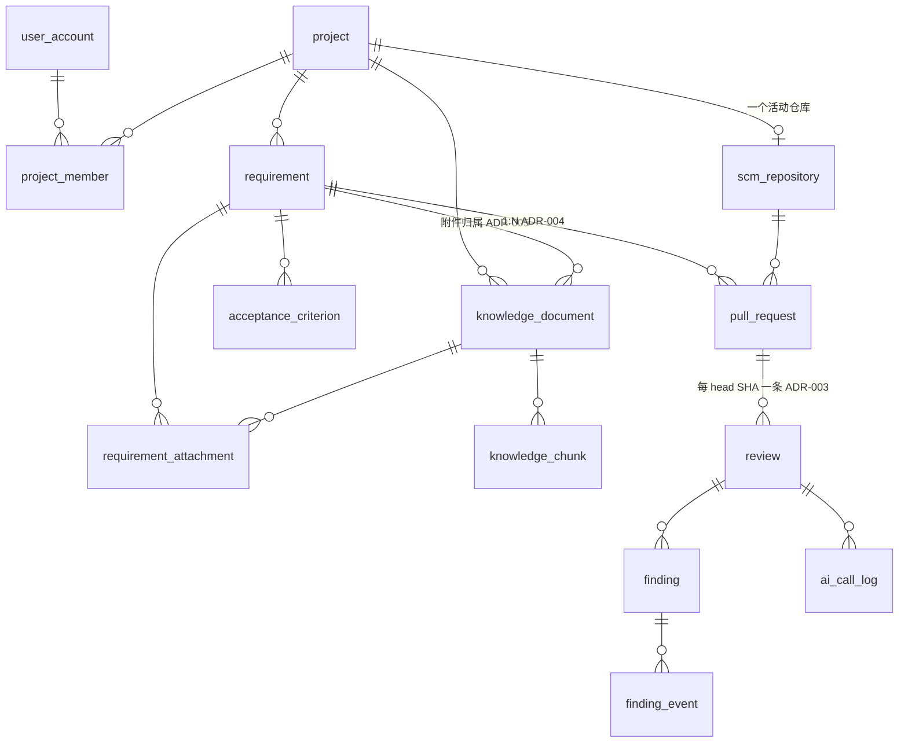
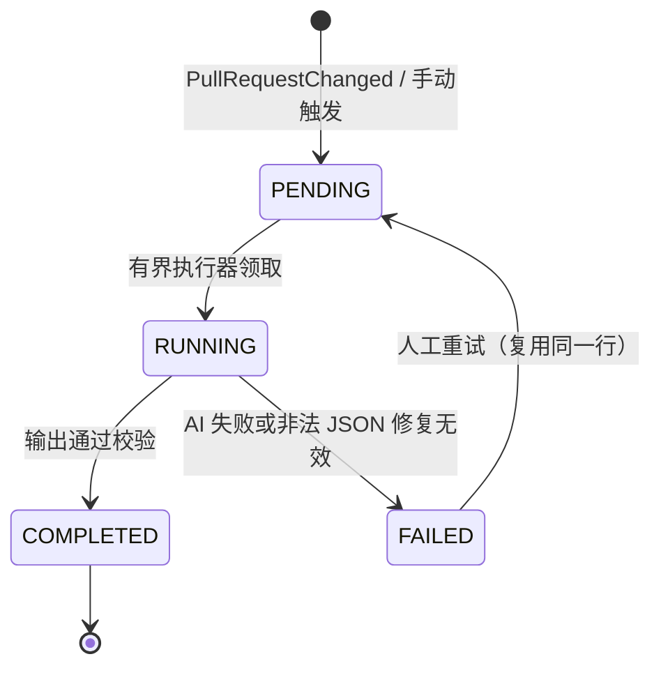
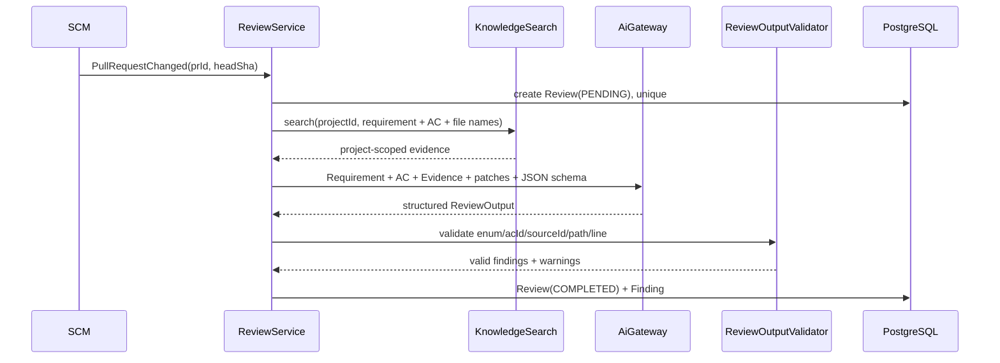

# ForgePilot V2 架构规范

状态：**Phase 0 已冻结（2026-08-19）**。本文是 V2 的**技术权威**：模块边界、数据模型、流程契约、技术栈与运行边界。

- 产品定义（定位、角色、范围、验收）见 [PRD.md](./PRD.md)。
- 决策理由见 [adr/](./adr/README.md)；本文只陈述**规则**，不重复论证。
- 实施顺序见 [IMPLEMENTATION-PLAN.md](./IMPLEMENTATION-PLAN.md)。
- Legacy 资产取舍见 [LEGACY-MIGRATION-MATRIX.md](./LEGACY-MIGRATION-MATRIX.md)。

> **单一事实源纪律**：14 表、依赖规则、状态机、运行边界只在本文定义。其他文档引用本文，不复述。

---

## 1. 模块与边界

### 1.1 顶层包

```text
com.forgepilot
├── common        # API error、paging、clock、纯安全工具
├── auth          # 登录、Cookie/Session、Spring Security
├── project       # Project、Member、Role、ProjectAccessService
├── requirement   # Requirement、AC、附件关系、质量检查
├── scm           # Repository、PR、Webhook、GitHub/GitLab provider
├── knowledge     # Document、Chunk、ingestion、search
├── ai            # provider-neutral chat/embed gateway
└── review        # Review Engine、Finding、人工决策
```

只有这 8 个顶层包。**禁止**出现 `agent/patch/mq/rag/repo/pullrequest/context/assistant/finding` 顶层包。

不强制四层：每个 feature 只建实际需要的类，不为目录对称创建空的 `domain/application/infrastructure/web`。
仅两处例外允许子包——`scm.github` / `scm.gitlab`（provider 协议差异）、`ai.openai`（外部协议）。

`review` 包的目标形态（示例，非强制清单）：

```text
review/  ReviewController · ReviewService · ReviewRepository · Review · Finding
         FindingRepository · FindingLifecycleService · ReviewContextBuilder
         ReviewEngine · ChangedFileBatcher · ReviewOutputValidator
```

### 1.2 职责边界

| 模块 | 只负责 | 明确不负责 |
|---|---|---|
| `project` | 成员、角色、项目隔离、仓库/知识入口 | Sprint、工时、看板、审批流 |
| `requirement` | 需求、AC、指派、质量检查、附件关系 | 通用任务管理、聊天平台 |
| `scm` | 凭据、Webhook、PR 元数据与 patch、`REQ-N` 解析 | Review 结论、本地 Git 工作区 |
| `knowledge` | 文档、Chunk、Embedding、项目内检索 | Requirement 状态、Review 编排、代码索引 |
| `ai` | OpenAI-compatible chat/embed 协议与调用记录 | 业务 Prompt、Agent 编排、自动决策 |
| `review` | 组装上下文、运行唯一引擎、Finding、人工决策 | SCM 凭据管理、知识入库、自动修复 |

### 1.3 依赖规则（单向，唯一定义处）

```text
common   ←  auth, project, ai
common, project                              ←  scm
common, project, ai                          ←  knowledge
common, project, knowledge, ai               ←  requirement
common, project, scm, knowledge, requirement, ai  ←  review
```

- 业务模块**不依赖 auth**：Controller 从登录上下文取 `userId` 后作为参数传入业务 Service。
- `scm` **不调用** `review`：`scm` 发布进程内 `PullRequestChanged`，`review` 监听。
- `requirement` 可调用 `knowledge` 创建文档；`knowledge` 永不反查 requirement（只收不透明 scope id）。
- `review` 是唯一跨模块编排者，但**不得访问外模块 Repository**，只经对方 Service/Query facade。
- Finding 属于 `review` 内聚，不外拆。

### 1.4 ArchUnit 强制项

1. 顶层包 cycle = 0。
2. 禁止包不存在（上列 9 个名字）。
3. `scm` 的编译期依赖不含 `review`。
4. 跨 feature 不直接注入对方 `*Repository`。
5. Controller 不直连跨模块 Repository。

---

## 2. 数据模型

### 2.1 14 张表（唯一定义处）

| 表 | 核心职责 | 关键约束 |
|---|---|---|
| `user_account` | 本地演示账户 | `username` unique；password_hash、enabled、session_version |
| `project` | 项目边界 | name、created_by、status |
| `project_member` | 成员与角色 | `(project_id,user_id)` unique；`UNIQUE(project_id) WHERE role='LEADER'`，Service 事务保证至少一个 LEADER（ADR-004） |
| `requirement` | 需求、指派、状态、最新质量结果 | project_id、assignee_id、status、quality_json/version/checked_at；`UNIQUE(project_id,id)` |
| `acceptance_criterion` | AC | `(requirement_id,seq)` unique；`UNIQUE(requirement_id,id)` |
| `knowledge_document` | 项目知识与需求附件共用内容 | project_id、source_type、source_requirement_id（ADR-005）、text、status、model/version；`UNIQUE(project_id,id)` |
| `requirement_attachment` | Requirement↔Document 关系 | project_id；`(requirement_id,document_id)` unique；双复合 FK（ADR-006） |
| `knowledge_chunk` | Chunk 与唯一向量 | project_id、document_id、seq、content、metadata、`embedding vector`（无维度，ADR-001）、provider/model/version/dimension |
| `scm_repository` | 项目的活动仓库与加密凭据 | `project_id` unique；provider、external_id、api_base、encrypted_token/secret；`UNIQUE(project_id,id)` |
| `pull_request` | PR/MR 快照与需求关联 | `(repository_id,external_number)` unique；requirement_id nullable + 普通索引（ADR-004/007）；`UNIQUE(project_id,id)` |
| `review` | 一个 head SHA 的审查、摘要与 Decision | `(pull_request_id,head_sha)` unique（ADR-003）；status、decision、decision_by/at/comment、engine/prompt/model 审计列 |
| `finding` | Review 问题当前态 | review_id、requirement_id、ac_id、path、line、evidence、status、assignee、fingerprint |
| `finding_event` | Finding 人工状态与指派审计 | finding_id、actor_id、action、from/to、comment、created_at |
| `ai_call_log` | 评测与故障定位 | project_id、review_id、use_case、model、token、latency、status、error |

**不建**：`scm_connection`（并入 `scm_repository`）、`review_task/report/issue`、`review_decision`（Decision 在 `review` 行上，唯一键天然保证同 head 只一次终局）、`webhook_delivery`、任何 vector 影子表。
新增表必须有已发生的业务事实 + ADR 证明现有模型无法表达。

### 2.2 关系图



### 2.3 项目隔离

1. 每张项目内业务表携带 `project_id`；指向另一张项目内业务表的外键一律为**含 `project_id` 的复合外键**（ADR-006）。被引用表配 `UNIQUE(project_id,id)`。
2. Service 层**不写**跨项目一致性校验——由数据库拒绝，异常映射为 409/422。
3. Repository 查询必须接受 `projectId`；禁止裸 id 查询后补权限判断。
4. 向量检索的 `project_id` 必须在 SQL 中硬过滤，不是召回后内存过滤。
5. 附件检索边界：`source_type='REQUIREMENT_ATTACHMENT'` 的文档只对所属 Requirement 可见（ADR-005）：
   `WHERE project_id=:p AND (source_type<>'REQUIREMENT_ATTACHMENT' OR source_requirement_id=:r)`
6. 集成测试固定包含 A 项目用户猜 B 项目 requirement/document/review/finding id 的越权用例。

### 2.4 命名与约定

| 对象 | 规范 |
|---|---|
| 表名 / 列名 | `snake_case` 单数（`pull_request`、`head_sha`） |
| 主键 | `id`，BIGINT identity |
| 外键列 | `<被引用表>_id` |
| 时间列 | `created_at` / `updated_at`，`timestamptz`，UTC 存储 |
| 枚举 | 数据库存 `varchar` + `CHECK`，Java 侧 enum；全大写下划线 |
| Flyway | `V<n>__<snake_case>.sql`，V1 为唯一初始化脚本 |
| REST 路径 | `/api/projects/{projectId}/...`，项目内资源一律带 projectId 段 |
| 错误响应 | `common` 统一 `{code, message, traceId}`；不复用 Legacy error code |
| Java 类 | 实体无 `Entity` 后缀（`Review` 而非 `ReviewEntity`） |

---

## 3. Review 流程

### 3.1 触发与幂等

`scm` 完成验签与 PR 同步后发布进程内 `PullRequestChanged`；`review` 监听并按 `(pull_request_id, head_sha)` 幂等创建 Review（ADR-003）。
自动触发与人工重试是同一个 `ReviewService.requestReview(...)` 的两个入口，不是两个引擎。
Webhook 保存 PR 后即返回 202，不等待 LLM。

### 3.2 执行状态机



崩溃留下的停滞 PENDING/RUNNING 同样由人工重试重置重跑。Decision 与执行状态正交：`PENDING | APPROVE | REQUEST_CHANGES`。

### 3.3 单次 Review（小 PR 路径）



### 3.4 大 PR 分批（ADR-002）

"一次 Review" ≠ "一次 LLM 调用"。大 PR 由 `ChangedFileBatcher` 分批：

1. Batch 阶段只产 **Finding candidate** 与 **AC evidence**，**不产 AC verdict**。
2. 全部 Batch 完成后 **Final Merge/Synthesis** 统一产出 ReviewOutput。
3. Finding 按稳定 fingerprint 去重（含大小写敏感 path，不做 lower-case）。
4. 任一 Batch 非法 JSON 且修复失败 → 整个 Review = FAILED，不输出部分成功报告。
5. 必须保存 truncation/coverage manifest，未审查文件在 UI 显式呈现，禁止静默截断。

绝不因分批产生第二套 Pipeline。

### 3.5 输出校验与证据规则

- 每条 AC 最终必须有 `COVERED | NOT_FOUND | AT_RISK`；模型漏项由 Validator 补 `NOT_FOUND`。
- `acId` 必须属于当前 Requirement；`sourceId` 必须在本次召回白名单；`filePath` 必须在 changed files 内。
- 行号必须落在 patch 可验证范围，无法验证则不输出精确行号。
- Finding 证据保存不可变 excerpt + hash，历史 Review 不受知识文档后续变更影响。
- 非法 JSON 允许**一次** format-repair；仍失败则 FAILED，**绝不生成"成功空报告"**。

---

## 4. AI 边界

### 4.1 唯一技术入口

```text
AiGateway.chat(prompt, schema, useCase)
AiGateway.embed(texts, embeddingConfig)
```

`ai` 负责 HTTP、认证、超时、一次有限重试、调用元数据、Token/延迟与错误分类。
它**不知道** Requirement/Finding/Review 等业务类型，也不暴露 tool loop。
业务 Prompt 归 `requirement` 与 `review` 各自所有；不建 Prompt Registry，不建万能 ContextBuilder。

### 4.2 ReviewContext

```text
ReviewContext
├── requirement: title, background, description
├── acceptanceCriteria[]: id, text
├── knowledgeEvidence[]: sourceId, documentId, chunkId, excerpt, score
├── pullRequest: provider, repo, number, baseSha, headSha, title
├── changedFiles[]: path, changeType, providerPatch
└── truncation: skipped/truncated file details
```

无 `relevantCode[]`：MVP 只审 SCM API 返回的 changed-file patch，不 clone、不索引代码、不按 import/调用图扩张。

### 4.3 Prompt 安全

Requirement、文档、PR 标题、代码注释**全部是不可信数据**，不得改变 system/task 指令；发送前做敏感信息脱敏与预算裁剪。

---

## 5. Knowledge

- 一个部署一个 Embedding provider/model/dimension；**部署配置不得改变 schema**（ADR-001）。
- `knowledge_chunk.embedding` 是唯一向量存储，pgvector **无维度 `vector`**；无 JSON 双写、无第二 vector 表、无运行时 DDL。
- `V1__init.sql` 不绑定模型维度、不建向量索引；Phase 4 定下 Profile 后由独立 migration 建 HNSW expression index，检索 SQL 须用一致的 cast 表达式。
- 应用层写入时校验向量维度与当前 Profile 一致，不一致显式失败。
- 换模型是维护操作：停写 → reindex → 重建索引；失败保留旧数据。不做在线双版本。

---

## 6. 前端信息架构

一级导航只有三个：**项目**、**研发需求**、**代码审查**。

```text
/projects
/projects/:id/members
/projects/:id/settings       # SCM + Knowledge
/requirements
/requirements/:id
/reviews
/reviews/:id
```

Workbench、Knowledge、Repository、Metrics、Agent、Patch、AI Logs 均**不做**一级页面。
知识检索测试不面向普通用户；管理员只需看到文档状态与失败原因。
AI 置信度、Finding 人工状态、Review Decision 在 UI 上必须明确分开呈现。

---

## 7. 技术栈与运行边界

### 7.1 组件与必要性

| 组件 | 对应需求 | 删除后果 |
|---|---|---|
| Spring Boot / MVC | 业务 API、Webhook、编排 | 无后端产品 |
| Spring Security | 三角色与人工决策可信边界 | 只能做单用户 Demo |
| JPA + PostgreSQL | 业务状态与审计 | 无业务闭环 |
| Flyway | 干净 V1 与可重复部署 | 结构不可复现 |
| pgvector | 项目规范语义检索 | 退化为需求+Diff 审查 |
| OpenAI-compatible Chat / Embedding | Quality 与 Review / 检索 | 无 AI 分析 / 只能关键词 |
| GitHub / GitLab API | 真实 PR 与 patch | 退化为手工贴 Diff |
| Vue 3 | 三角色可操作闭环 | 只有接口 Demo |
| ArchUnit | 防止长回旧循环依赖 | 长期高复发风险 |
| Testcontainers | 验证真实 PG/pgvector/约束 | H2 证明不了隔离与向量行为 |
| Docker Compose | 答辩环境可复现 | 环境不可复现 |
| 有界进程内执行器 | Webhook 不等待长 LLM | 只能同步阻塞 |

**不引入**：RabbitMQ/Kafka/Redis/ES/Milvus/Qdrant、Resilience4j Circuit Breaker、分布式锁、服务发现、API Gateway、独立向量服务、独立 Sandbox、完整 OTel/Prometheus/Grafana、第二 AI runtime。
HTTP timeout + 一次有限 retry + Review FAILED + 人工 retry 足够覆盖当前故障事实。

### 7.2 运行边界（初值，Phase 6 评测后可调；调整需更新本表）

| 参数 | 初值 | 说明 |
|---|---:|---|
| 单 PR 最大 changed files | 300 | 超出进 truncation manifest 并 UI 显式提示 |
| 单文件 patch 最大字符 | 60000 | 超出按行截断并标注 |
| 单 Batch 输入预算 | 60000 字符 | `ChangedFileBatcher` 分批依据 |
| LLM 单次调用超时 | 120 s | 超时按瞬时失败处理 |
| LLM 重试次数 | 1 | 仅瞬时错误（429/5xx/网络） |
| 并发 Review 上限 | 2 | 有界执行器线程数，小内存部署可降为 1 |
| 单文件上传上限 | 5 MB | `KnowledgeUploadValidator` |
| 检索 TopK | 8 | project-scoped |

部署内存受限时（如 4 GB 机器）必须给 JVM 与 Postgres 显式设上限，并把并发 Review 降为 1。

---

## 8. 风险与防复发

| 风险 | 阻断手段 |
|---|---|
| `scm → review` 反向依赖复发 | 事件 contract + ArchUnit 编译期检查 |
| requirement ↔ knowledge 双向依赖 | 附件关系只由 requirement 保存，knowledge 只收不透明 id |
| AiGateway 变成 Agent 工具箱 | 接口只允许 chat/embed，不暴露 tool loop |
| `review` 变成新大泥球 | 可编排但禁访问外模块 Repository；Finding 是内聚不是吸收 |
| 大 PR 静默丢文件 | 分批 + coverage manifest + UI 显式呈现 |
| 进程内任务丢失 | 状态可见 + 幂等 retry；压测证明不可接受再评估持久队列 |
| Embedding 变更 | schema 不绑维度；换 Profile 走维护窗口 |
| Prompt injection / 伪造证据 | 不可信标记 + source 白名单 + 输出回查 |
| 范围回弹 | P1 清单在核心 E2E 完成前不得实施 |

---

## 9. 一条不可替代的因果链

> 需求与 AC 说明**应该做什么**，项目知识说明**在本项目里应该怎么做**，PR Diff 说明**实际改了什么**；
> ForgePilot 比较三者并生成可核验证据，最终由人决定是否通过。

任何新增模块若无法说明它改变了这条链上的哪个用户结果，就不进入 ForgePilot V2。
