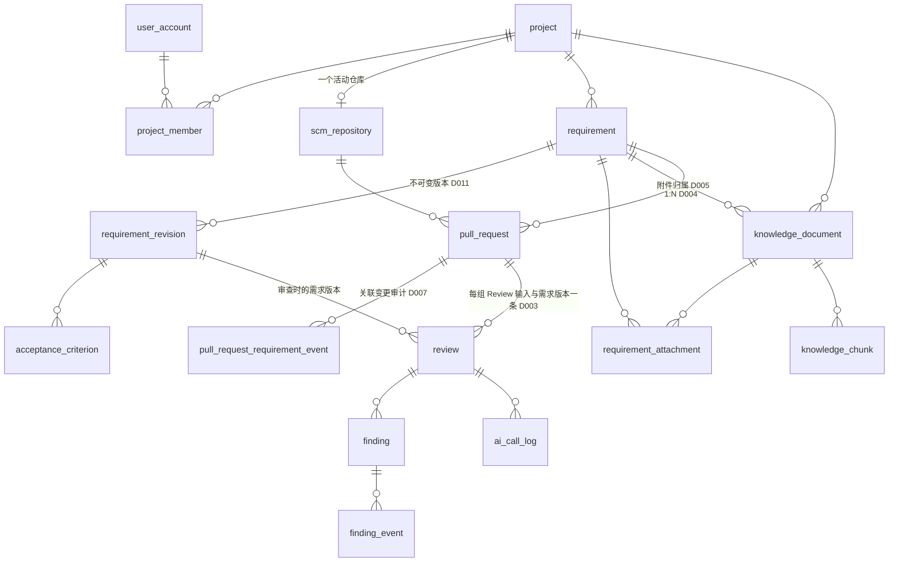
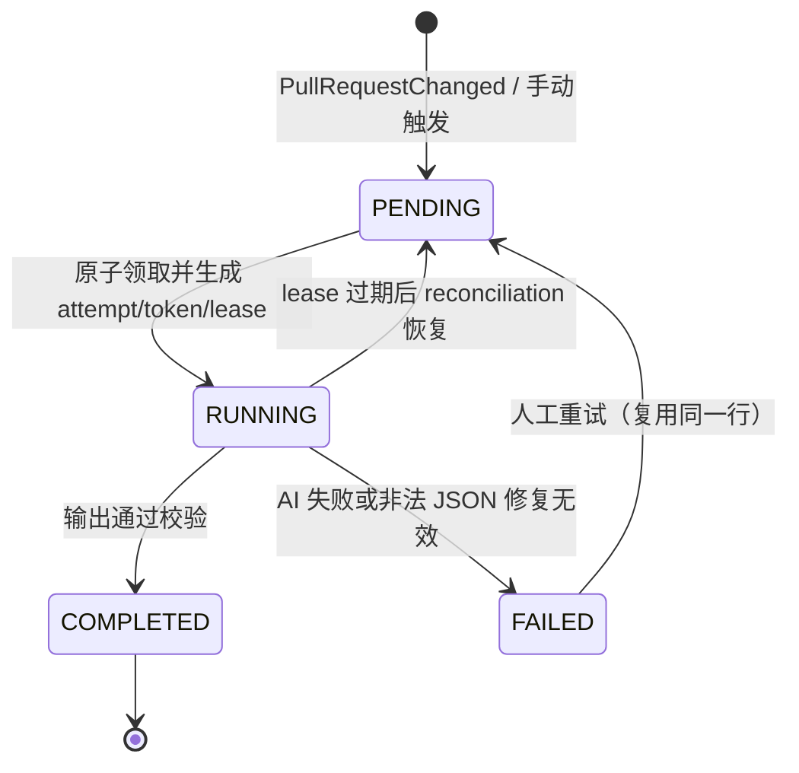
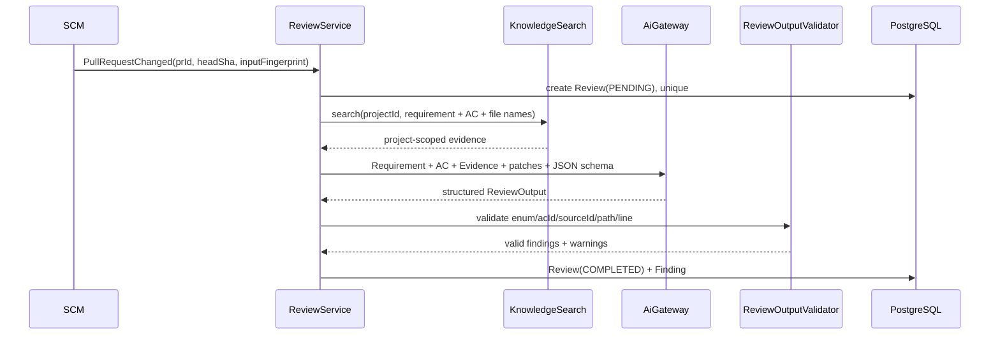

# ForgePilot V2 架构规范

状态：**R2.5 顶部导航基线（2026-08-23）**。本文是 V2 的**技术权威**：模块边界、数据模型、流程契约、技术栈与运行边界。Phase 0–8 历史基线保持有效；D017 的主链路补全与 D018 的导航布局均已通过独立 Trellis Finish 闸门。

- 产品定义（定位、角色、范围、验收）见 [PRD.md](./PRD.md)。
- 决策理由见 [DECISIONS.md](./DECISIONS.md)；本文只陈述**规则**，不重复论证。
- 实施顺序见 [IMPLEMENTATION-PLAN.md](./IMPLEMENTATION-PLAN.md)。
- Legacy 资产取舍见 [LEGACY-MIGRATION-MATRIX.md](./LEGACY-MIGRATION-MATRIX.md)。

> **单一事实源纪律**：16 表、依赖规则、状态机、运行边界只在本文定义。其他文档引用本文，不复述。

---

## 1. 模块与边界

### 1.1 顶层包

```text
com.forgepilot
├── common        # API error、paging、clock、纯安全工具
├── auth          # 登录、Cookie/Session、Spring Security
├── project       # Project、Member、Role、ProjectAccessService
├── requirement   # Requirement、AC、附件关系、质量检查、一次性实现建议
├── scm           # Repository、PR、Webhook、GitHub/GitLab provider
├── knowledge     # Document、Chunk、ingestion、search
├── ai            # provider-neutral chat/embed gateway
└── review        # Review Engine、Finding、人工决策
```

只有这 8 个顶层包。**禁止**出现 `agent/patch/mq/rag/repo/pullrequest/context/assistant/finding` 顶层包。

不强制四层：每个 feature 只建实际需要的类，不为目录对称创建空的 `domain/application/infrastructure/web`。
仅两处例外允许子包——`scm.github` / `scm.gitlab`（provider 协议差异）、`ai.openai`（外部协议）。

`review` 包的目标形态（示例，非强制清单）：

```text
review/  ReviewController · ReviewService · ReviewRepository · Review · Finding
         FindingRepository · FindingLifecycleService · ReviewContextBuilder
         ReviewEngine · ChangedFileBatcher · ReviewOutputValidator
```

### 1.2 职责边界

| 模块 | 只负责 | 明确不负责 |
|---|---|---|
| `project` | 成员、角色、项目隔离、仓库/知识入口 | Sprint、工时、看板、审批流 |
| `requirement` | 需求、AC、指派、质量检查、附件关系、一次性实现建议 | 通用任务管理、聊天平台、多轮会话 |
| `scm` | 凭据、Webhook、PR 元数据与 patch、`REQ-N` 解析 | Review 结论、本地 Git 工作区 |
| `knowledge` | 文档、Chunk、Embedding、项目内检索 | Requirement 状态、Review 编排、代码索引 |
| `ai` | OpenAI-compatible chat/embed 协议与调用记录 | 业务 Prompt、Agent 编排、自动决策 |
| `review` | 组装上下文、运行唯一引擎、Finding、人工决策 | SCM 凭据管理、知识入库、自动修复 |

### 1.3 依赖规则（单向，唯一定义处）

```text
common   ←  auth, project, ai
common, project, requirement                 ←  scm
common, project, ai                          ←  knowledge
common, project, knowledge, ai               ←  requirement
common, project, scm, knowledge, requirement, ai  ←  review
```

- 业务模块**不依赖 auth**：Controller 从登录上下文取 `userId` 后作为参数传入业务 Service。
  该措辞按 [D013.6](./DECISIONS.md#d013) 收窄为「不依赖 auth 的**认证机制**」；账户展示信息经 `auth` 的只读 Query facade 读取。
- `scm` 依赖 `requirement` **仅限只读 Query facade**（[D015.6](./DECISIONS.md#d015)）：`REQ-<n>` 必须按 PR 所属项目解析，
  且解析失败不得阻断入库，而复合外键只会让整条插入失败、捕获后继续又被 [D013.11](./DECISIONS.md#d013) 禁止，
  因此解析必须发生在写入之前。方向上无环（`requirement` 不依赖 `scm`），且 `scm` 仍**不得**注入 `RequirementRepository`。
- `scm` **不调用** `review`：`scm` 发布进程内 `PullRequestChanged`，`review` 监听。
- `requirement` 可调用 `knowledge` 创建文档；`knowledge` 永不反查 requirement（只收不透明 scope id）。
- `review` 是唯一跨模块编排者，但**不得访问外模块 Repository**，只经对方 Service/Query facade。
- Finding 属于 `review` 内聚，不外拆。

### 1.4 ArchUnit 强制项

1. 顶层包 cycle = 0。
2. 顶层包必须在上列 8 个名字之内；禁止包名（`agent/patch/mq/rag/repo/pullrequest/context/assistant/finding`）不得出现。
3. `scm` 的编译期依赖不含 `review`。
4. 跨 feature 不直接注入对方 `*Repository`。
5. Controller 不直连跨模块 Repository。
6. 子包必须在允许清单内（仅 `scm.github`、`scm.gitlab`、`ai.openai`）。

`ArchitectureRulesTest` 另有两条**反重言式**测试：用 `*.fixture` 包里故意违规的类证明上述规则真的会失败，而不是因为匹配不到任何类而空过。

---

## 2. 数据模型

### 2.1 16 张表（唯一定义处）

| 表 | 核心职责 | 关键约束 |
|---|---|---|
| `user_account` | 本地演示账户 | `username` unique；password_hash、enabled、session_version |
| `project` | 项目边界 | name、created_by（→ `user_account`）、status |
| `project_member` | 成员、角色与项目级 SCM 身份 | `(project_id,user_id)` unique；`UNIQUE(project_id) WHERE role='LEADER'`，Service 事务保证至少一个 LEADER（D004）；`scm_external_user_id`（权限依据）、`scm_username`（仅显示）、`scm_identity_verified_at`，`(project_id,scm_external_user_id)` unique（D010） |
| `requirement` | 需求稳定身份、指派、状态 | project_id、assignee_id（nullable，复合 FK 指向 project_member）、status、current_revision_id（可空，回填；复合 FK `(project_id,id,current_revision_id)` 指向自身 Revision）；`UNIQUE(project_id,id)` |
| `requirement_revision` | 不可变需求正文版本与该版本的质量结果 | project_id、requirement_id、seq、title/background/description、created_by、change_reason、created_at、quality_json/quality_version/quality_checked_at；`(requirement_id,seq)` unique；`UNIQUE(project_id,id)`、`UNIQUE(project_id,requirement_id,id)`（D006/D011） |
| `acceptance_criterion` | AC，归属具体 revision | project_id、requirement_revision_id、`ac_key`（稳定不可变业务身份）、`sort_order`（仅显示）、text；`(requirement_revision_id,ac_key)` unique；`UNIQUE(project_id,id)`、`UNIQUE(project_id,requirement_revision_id,id)`（D011） |
| `knowledge_document` | 项目知识与需求附件共用内容 | project_id、source_type、source_requirement_id（D005）、text、status、model/version；附件类型与归属必须匹配；`UNIQUE(project_id,id)`、`UNIQUE(project_id,id,source_requirement_id)` |
| `requirement_attachment` | Requirement↔Document 关系 | project_id；`(requirement_id,document_id)` unique、`(project_id,document_id)` unique（一个附件只有一个归属需求）；与 Document 的 source_requirement_id 双复合 FK（D006） |
| `knowledge_chunk` | Chunk 与唯一向量 | project_id、document_id、seq、content、metadata、`embedding vector`（无维度，D001）、provider/model/version/dimension |
| `scm_repository` | 项目的活动仓库与加密凭据 | `project_id` unique；provider、规范化 `instance_identity`、external_id、api_base、encrypted_token/secret；有 PR 后稳定身份三元组不可修改，api_base 更新须验证同一实例（D010）；`UNIQUE(project_id,id)` |
| `pull_request` | PR/MR 权威快照、作者与需求关联 | `(repository_id,external_number)` unique；当前 title、base_sha、head_sha、`review_input_fingerprint`（由规范化 base/head、changed-file manifest、patch 及可用的稳定 Diff version 确定性计算，title 不参与身份）；`changed_files` JSONB 保存 manifest 与每个 patch，使指纹输入可从数据库复现（D015.7）；source_revision/source_updated_at 仅用于乱序保护；requirement_id nullable + 普通索引（D004/D007）；author_external_user_id、author_username（不可变作者快照）、author_user_id（可重算映射，复合 FK 指向 project_member，列级 `ON DELETE SET NULL`，D010）；`UNIQUE(project_id,id)` |
| `pull_request_requirement_event` | **仅**记录 PR↔需求关联变更审计 | project_id、pull_request_id、from_requirement_id、to_requirement_id、actor_type(`USER/SYSTEM`)、actor_user_id（可空，→ `user_account`）、reason、created_at；CHECK 保证 type 与 actor 组合合法；与关联修改同事务写入（D007） |
| `review` | 一个 (head SHA、实际 Review 输入、需求版本) 的审查、上下文快照、摘要与 Decision | `UNIQUE NULLS NOT DISTINCT (pull_request_id,head_sha,review_input_fingerprint,requirement_revision_id)`（D003）；`UNIQUE(project_id,id)` 供 Finding 父 FK；`UNIQUE(project_id,id,execution_attempt)` 供 Finding 的 attempt 围栏；CHECK 保证 requirement_id 与 requirement_revision_id 同空或同非空、Decision 字段组合合法、终局 Decision 只能落在 COMPLETED 行、RUNNING 必带 token+lease；一次性 Decision 由 PR 行锁 + `WHERE decision='PENDING'` 条件更新保证；触发器冻结四元身份与 context_snapshot_json；project_id、status、decision、decision_by/at/comment、execution_attempt/token/lease、输入快照 `context_snapshot_json` 与输出摘要 `summary_json`（AC verdict、coverage、知识证据、warning）、engine/prompt_version/model 审计列 |
| `finding` | Review 问题当前态与跨轮血缘 | project_id、review_id、`review_attempt`、requirement_id、requirement_revision_id、ac_id、finding_type、path、line、evidence、status、assignee_id（nullable，→ project_member）、fingerprint(`finding_key`)、evidence_hash、`basis_hash`、continuity、carried_from_finding_id；永久父 FK `(project_id,review_id,review_attempt) → review(project_id,id,execution_attempt)`——父子关系与 attempt 围栏合一，过期 Worker 的插入由数据库而非应用检查拒绝；血缘 FK `(project_id,carried_from_finding_id)`；`UNIQUE(project_id,id)`、`UNIQUE(review_id,finding_key)`；CHECK 与约束触发器保证父子上下文 NULL-safe 一致（D006/D009） |
| `finding_event` | Finding 人工状态与指派审计 | project_id、finding_id（复合 FK）、actor_id（→ `user_account`）、action、from/to、comment、created_at |
| `ai_call_log` | 评测与故障定位 | project_id、review_id、requirement_id、requirement_revision_id（三者均可空且使用含 project_id 的复合 FK）、use_case、model、token、latency、status、error |

**不建**：`scm_connection`（并入 `scm_repository`）、`review_task/report/issue`、`review_decision`（Decision 在 `review` 行上且只写一次）、`webhook_delivery`、通用 `audit_event`（多态 entity_id 无法被 D006 复合外键约束）、任何 vector 影子表。执行恢复不另建任务表，使用 Review 上的 attempt/token/lease fencing 元数据。
新增表必须有已发生的业务事实 + 新决策记录证明现有模型无法表达。表数量是复杂度提醒，不是为守数字而把两个领域事实塞进一张表的理由。

### 2.2 关系图



### 2.3 项目隔离

除全局 `user_account` 与项目根 `project` 外，所有项目作用域表都携带 `project_id`。项目内外键必须把 `project_id` 一并带入，被引用表提供对应复合唯一键；指向全局 `user_account` 的审计 actor 是唯一例外。数据库负责拒绝跨项目写入，Repository 读路径仍必须接受 `projectId`，禁止裸 id 查询后再补权限判断。约束冲突统一映射为 409/422。

关键复合引用至少包括：

```text
requirement.assignee
  (project_id, assignee_id) -> project_member(project_id, user_id)

requirement_revision
  (project_id, requirement_id) -> requirement(project_id, id)

knowledge_document
  (project_id, source_requirement_id) -> requirement(project_id, id)

requirement_attachment
  (project_id, requirement_id) -> requirement(project_id, id)
  (project_id, document_id, requirement_id)
    -> knowledge_document(project_id, id, source_requirement_id)

requirement.current_revision
  (project_id, id, current_revision_id)
    -> requirement_revision(project_id, requirement_id, id)

acceptance_criterion
  (project_id, requirement_revision_id)
    -> requirement_revision(project_id, id)

pull_request
  (project_id, repository_id) -> scm_repository(project_id, id)
  (project_id, requirement_id) -> requirement(project_id, id)
  (project_id, author_user_id) -> project_member(project_id, user_id)
    ON DELETE SET NULL (author_user_id)

review
  (project_id, pull_request_id) -> pull_request(project_id, id)
  (project_id, requirement_id, requirement_revision_id)
    -> requirement_revision(project_id, requirement_id, id)

finding
  (project_id, review_id, review_attempt)
    -> review(project_id, id, execution_attempt)
  (project_id, requirement_revision_id, ac_id)
    -> acceptance_criterion(project_id, requirement_revision_id, id)
  (project_id, assignee_id) -> project_member(project_id, user_id)
  (project_id, carried_from_finding_id) -> finding(project_id, id)

finding_event
  (project_id, finding_id) -> finding(project_id, id)

knowledge_chunk
  (project_id, document_id) -> knowledge_document(project_id, id)

ai_call_log
  (project_id, review_id) -> review(project_id, id)
  (project_id, requirement_id) -> requirement(project_id, id)
  (project_id, requirement_id, requirement_revision_id)
    -> requirement_revision(project_id, requirement_id, id)

pull_request_requirement_event
  (project_id, pull_request_id) -> pull_request(project_id, id)
  (project_id, from_requirement_id) -> requirement(project_id, id)
  (project_id, to_requirement_id) -> requirement(project_id, id)
```

可空复合外键使用 PostgreSQL `MATCH SIMPLE`，因此不能用 Finding 的 nullable Requirement/Revision/AC 外键证明父 Review 存在。`finding` 必须永久保留指向父 Review 的复合外键，且该外键把 `review_attempt` 一并带上，指向 `review(project_id,id,execution_attempt)`——父子关系与执行围栏由同一把键承担；同时 migration 定义约束触发器，使用 `IS NOT DISTINCT FROM` 保证 Finding 的 `requirement_id` 与 `requirement_revision_id` 分别等于父 Review 对应列。Review 未关联 Requirement 时，Finding 两列必须都为空。父 Review 一侧改由「身份列与上下文快照创建后不可变」的触发器封死，而不是让子触发器去追父表更新。

Review 与 Finding 还必须具备以下行内约束：

```sql
-- review / finding 均适用
CHECK ((requirement_id IS NULL AND requirement_revision_id IS NULL)
    OR (requirement_id IS NOT NULL AND requirement_revision_id IS NOT NULL));

-- finding
CHECK (ac_id IS NULL OR requirement_revision_id IS NOT NULL);
CHECK (finding_type <> 'CODE_QUALITY' OR ac_id IS NULL);

-- review decision 字段组合；状态转换仍由条件更新保证
CHECK (
  (decision = 'PENDING'
    AND decision_by IS NULL AND decision_at IS NULL AND decision_comment IS NULL)
  OR
  (decision IN ('APPROVE', 'REQUEST_CHANGES')
    AND decision_by IS NOT NULL AND decision_at IS NOT NULL)
);
```

审计表的 `actor_id` 指向 `user_account`，因为退出项目不能抹掉既成事实；`pull_request.author_user_id` 与 Finding assignee 指向 `project_member`，因为成员退出后活权限必须失效。

附件的唯一事实源是 `requirement_attachment`，`knowledge_document.source_requirement_id` 只是受约束检索投影。附件 Document 必须满足 `source_type='REQUIREMENT_ATTACHMENT'` 且 scope 非空，公共知识必须 scope 为空；关系表通过 `(project_id,document_id,requirement_id) → knowledge_document(project_id,id,source_requirement_id)` 锁定二者相等，并以 `UNIQUE(project_id,document_id)` 保证一个 Document 最多属于一个 Requirement。Document 与关系同事务写入；提升为公共知识时复制为新 Document，不就地改写原附件。

需求文档首版仅接受 `.txt/.md` 的 UTF-8 文本：列表仍只返回元数据，项目成员点击后才通过带 `project_id + requirement_id + document_id` 的受保护 GET 路由读取正文或下载。文档必须同时匹配项目和附件关系；跨项目、跨需求与非成员统一返回 404。下载从已存 `title + text` 生成 UTF-8 响应，不增加原始二进制副本。

附件检索必须在 SQL 中同时硬过滤项目与 Requirement：

```sql
WHERE project_id = :projectId
  AND (source_type <> 'REQUIREMENT_ATTACHMENT'
       OR source_requirement_id = :requirementId)
```

SCM 仓库稳定身份由 `provider + instance_identity + external_id` 构成；`api_base` 可变但只能指向同一规范化实例。Webhook 只作触发，PR 当前值来自 Provider 权威快照，并以 Provider 可用的 source revision/time 单调规则拒绝旧快照回退。

固定集成测试包含：A 项目用户猜 B 项目 requirement/document/review/finding id；附件关系与投影不一致；Finding 无父 Review或父子上下文不一致；乱序 Webhook 回退；过期 Worker 持旧 token 写入。

### 2.4 命名与约定

| 对象 | 规范 |
|---|---|
| 表名 / 列名 | `snake_case` 单数（`pull_request`、`head_sha`） |
| 主键 | `id`，BIGINT identity |
| 外键列 | `<被引用表>_id` |
| 时间列 | `created_at` / `updated_at`，`timestamptz`，UTC 存储 |
| 枚举 | 数据库存 `varchar` + `CHECK`，Java 侧 enum；全大写下划线 |
| Flyway | `V<n>__<snake_case>.sql`，V1 为唯一初始化脚本 |
| REST 路径 | `/api/projects/{projectId}/...`，项目内资源一律带 projectId 段 |
| 错误响应 | `common` 统一 `{code, message, traceId}`；不复用 Legacy error code |
| Java 类 | 实体无 `Entity` 后缀（`Review` 而非 `ReviewEntity`） |

---

## 3. Review 流程

### 3.1 触发与幂等

Webhook 是同步信号，不是 PR 真值。`scm` 先完成 raw-byte 验签，再从 Provider 读取权威 PR/changed-file 快照；仅当 source revision/updated time 不旧于当前记录时才更新 `pull_request`，旧事件不得回退 head、base 或 patch。规范化快照生成确定性的 `review_input_fingerprint`，至少覆盖 provider/instance/repository、base/head SHA、changed-file manifest 与每个 patch 内容；Provider 的稳定 Diff version 可纳入哈希，仅用于事件排序的 revision/time 不得单独制造新身份。

`scm` 在更新 PR 的数据库事务内发布**同步**进程内 `PullRequestChanged`；`review` 的同步监听器参加同一事务，按 `(pull_request_id, head_sha, review_input_fingerprint, requirement_revision_id)` 幂等创建或取得 Review(PENDING)。监听失败则整个 SCM 事务回滚，禁止出现“PR 已更新但无应有 PENDING Review”的提交结果。`scm` 只依赖事件 contract，仍不编译依赖 `review`。

执行器只能在事务成功提交后的 after-commit callback 中启动；提交前不得有 Worker 读取该 Review。after-commit 提交失败不回滚已提交的 PR/PENDING，而是保留 PENDING 供 reconciliation 恢复。自动触发、人工触发与失败重试最终共用 `ReviewService.requestReview(...)`，不是多个引擎。

Webhook 在 PR 与 PENDING Review 均提交后返回 202，不等待 LLM。轻量 `ReviewReconciliationScheduler` 只处理**已经落库但未执行或停滞**的任务：未被原子领取的超时 PENDING，以及 lease 已过期的 RUNNING；统一回到同一个领取/执行路径。**禁止**按“当前 head + 当前上下文无 Review”补建缺失 Review——需求关联或版本变化后的重审一律人工触发。

**Review Identity、当前有效性与 Decision Gate 是三个不同概念**：

```text
Review Identity = pull_request_id + head_sha + review_input_fingerprint + requirement_revision_id
Current Validity = Review 的 head/fingerprint/requirement revision 均等于 PR 当前值
Decision Gate = pull_request_id + head_sha 上是否已有 REQUEST_CHANGES
```

Base、changed files、patch 或纳入指纹的稳定 Diff version 改变时，即使 head SHA 不变，也必须形成新的 Review Identity；旧 Review 保留但不再当前有效。同一 head 一旦出现 `REQUEST_CHANGES`，任何需求版本或 Diff fingerprint 都不能再 APPROVE，解除只能靠新 head SHA。

Decision 是一次性人工终局事实，只允许 `PENDING → APPROVE | REQUEST_CHANGES`，不得覆盖、反转或重写。写入事务必须 `SELECT ... FOR UPDATE` 锁 `pull_request` 行，并逐条校验以下前置条件，再以 `WHERE decision='PENDING'` 条件更新；禁止用普通 `EXISTS` 查询或无条件 save 代替：

1. 目标 Review 的 `status = COMPLETED`；
2. 目标 Review 的 `decision = PENDING`；
3. `review.head_sha = pull_request.head_sha`；
4. `review.review_input_fingerprint = pull_request.review_input_fingerprint`；
5. `review.requirement_revision_id IS NOT DISTINCT FROM pull_request` 当前关联需求版本（NULL 亦须相等）；
6. 该 `head_sha` 上不存在任何 `REQUEST_CHANGES`（否则只能靠新 head 解除）。

条件更新影响行数必须为 1，否则按并发冲突返回 409。Review 增加 CHECK：`decision=PENDING` 时 `decision_by/at/comment` 均为空；终局时 actor/time 必须非空（comment 可按产品规则选填）。MVP 不支持撤销或改判；未来若确有需求再新增审计模型与决策记录。

### 3.2 执行状态机



领取必须是单条原子条件更新：只有 PENDING 或 lease 已过期的 RUNNING 可领取；每次领取递增 `execution_attempt`、生成新 `execution_token` 并写 `lease_until`。Worker 完成、失败或续租时必须同时匹配 `review_id + execution_token + status=RUNNING`，过期 Worker 的写入影响行数为 0，不能覆盖新尝试、插入 Finding 或改写 Review。

reconciliation 恢复已落库但未执行的 PENDING 和 lease 过期的 RUNNING，**不补建**从未存在的 Review。失败重试复用原行并产生新 attempt/token；`COMPLETED` 永不重跑或覆盖。Decision 与执行状态正交：`PENDING | APPROVE | REQUEST_CHANGES`。

### 3.3 单次 Review（小 PR 路径）



### 3.4 大 PR 分批（D002）

"一次 Review" ≠ "一次 LLM 调用"。大 PR 由 `ChangedFileBatcher` 分批：

1. Batch 阶段只产 **Finding candidate** 与 **AC evidence**，**不产 AC verdict**。
2. 全部 Batch 完成后 **Final Merge/Synthesis** 统一产出 ReviewOutput。
3. Finding 按稳定 fingerprint 去重（含大小写敏感 path，不做 lower-case）。
4. 任一 Batch 非法 JSON 且修复失败 → 整个 Review = FAILED，不输出部分成功报告。
5. 必须保存 truncation/coverage manifest，未审查文件在 UI 显式呈现，禁止静默截断。

绝不因分批产生第二套 Pipeline。

### 3.5 输出校验与证据规则

- 每条 AC 最终必须有 `COVERED | NOT_FOUND | AT_RISK`；模型漏项由 Validator 补 `NOT_FOUND`。
- `acId` 必须属于当前 Requirement Revision；`sourceId` 必须在本次召回白名单；`filePath` 必须在 changed files 内。
- 行号必须落在 patch 可验证范围，无法验证则不输出精确行号。
- Finding 证据保存不可变 excerpt + hash，历史 Review 不受知识文档后续变更影响。
- Finding 跨轮血缘（`continuity`、`evidence_hash`、`basis_hash`、`carried_from_finding_id`、`finding_key`）规则见 D009；`evidence_hash` 必须基于确定性源码证据，`basis_hash` 必须基于所引用 AC/Requirement Revision、知识 excerpt/hash 与确定性规则版本，二者均禁止哈希模型生成的描述。只有两者均未变才允许继承历史误报抑制。
- Review 创建时保存 `head_sha`、`review_input_fingerprint`、`requirement_id`、`requirement_revision_id` 及 Requirement/AC/Knowledge evidence/truncation 的不可变上下文快照；历史页面禁止通过 PR 当前关联反推审查语义。页面以当前 PR 的 head/fingerprint/revision 对比快照派生“当前/已过期”，不写 `INVALIDATED` 状态。
- Requirement 进入 READY 后正文与 AC 锁定，修改须由 LEADER 创建新的不可变 Revision（D011）；旧 Review **永不失效、永不覆盖**，上下文变更后构成新的 Review 身份，页面显示"审查已过期"由人工触发重审。`review` 不设 `INVALIDATED` 状态——执行状态与语义有效性是两个维度。
- 非法 JSON 允许**一次** format-repair；仍失败则 FAILED，**绝不生成"成功空报告"**。

### 3.6 Finding 跨 Review 连续性

每条 Review 保存自己的 Finding 快照，历史行不可覆盖。连续性计算只在同一 Pull Request 内进行，按以下确定性规则执行：

1. `finding_key` 同时用于批内去重和跨 Review 匹配。`CODE_QUALITY` 使用大小写敏感 path + 归一化位置 + 类别；`REQUIREMENT` 还必须加入 `requirement_id + ac_key`。`ac_key` 是跨 Revision 稳定业务身份，不得用数据库行 id 或显示顺序代替。
2. `evidence_hash` 只覆盖确定性源码证据：统一换行并去除易变行号，但不得对 Python/YAML 等缩进敏感内容做通用空白折叠。`basis_hash` 覆盖被引用 Requirement/AC 内容、知识 excerpt/hash 和确定性规则版本。两个 hash 均不得包含 LLM 自由文本。
3. `PERSISTING/NEW/NOT_REPORTED` 只比较同一 PR 紧邻的上一条 `COMPLETED` Review，按 `(created_at,id)` 确定性排序。匹配项仍存在时，新 Finding 为 `PERSISTING` 且从 `OPEN` 开始；上一轮存在、本轮未报告只查询派生 `NOT_REPORTED`，不落库、不自动判定修复。
4. `SUPPRESSED` 在同一 PR 全部历史中查该 `finding_key` 最近一次人工判定，按 `(finding_event.created_at,finding_event.id)` 排序。只有结果为 `REJECTED` 且 `evidence_hash`、`basis_hash` 都相同时，新 Finding 才以 `status=REJECTED + continuity=SUPPRESSED` 落库。
5. 计算优先级固定为 `SUPPRESSED > PERSISTING > NEW`。`carried_from_finding_id` 在 SUPPRESSED 时指向最近有效人工驳回的 Finding，在 PERSISTING 时指向紧邻上一条 COMPLETED Review 的匹配 Finding；来源必须属于同一 PR，由 Service 不变式和集成测试保证。

普通 `REJECTED` 不可重开；只有继承的 `SUPPRESSED` Finding 可经审计事件重开。重开后 `continuity` 仍为 `SUPPRESSED`，但状态回到 `OPEN` 并出现在主列表。

---

## 4. AI 边界

### 4.1 唯一技术入口

```text
AiGateway.chat(prompt, schema, useCase)
AiGateway.embed(texts, embeddingConfig)
```

`ai` 负责 HTTP、认证、超时、一次有限重试、调用元数据、Token/延迟与错误分类。
它**不知道** Requirement/Finding/Review 等业务类型，也不暴露 tool loop。
业务 Prompt 归 `requirement` 与 `review` 各自所有；Requirement Quality 与一次性 Implementation Guidance 共享 AI Gateway 但使用不同 schema。不建 Prompt Registry，不建万能 ContextBuilder。

### 4.2 ReviewContext

```text
ReviewContext
├── requirement: id, revisionId, title, background, description
├── acceptanceCriteria[]: acKey, text
├── knowledgeEvidence[]: sourceId, documentId, chunkId, excerpt, score
├── pullRequest: provider, instance, repo, number, baseSha, headSha, inputFingerprint, title
├── changedFiles[]: path, changeType, providerPatch
└── truncation: skipped/truncated file details
```

无 `relevantCode[]`：MVP 只审 SCM API 返回的 changed-file patch，不 clone、不索引代码、不按 import/调用图扩张。

### 4.3 Prompt 安全

Requirement、文档、PR 标题、代码注释**全部是不可信数据**，不得改变 system/task 指令；发送前做敏感信息脱敏与预算裁剪。

---

## 5. Knowledge

- 一个部署一个 Embedding provider/model/dimension；**部署配置不得改变 schema**（D001）。
- `knowledge_chunk.embedding` 是唯一向量存储，pgvector **无维度 `vector`**；无 JSON 双写、无第二 vector 表、无运行时 DDL。
- 初始化迁移 `V1__foundation.sql` 只启用 `vector` 扩展；`V4__knowledge_ai.sql` 建列时不绑定模型维度、不建向量索引。
- **本部署不建任何向量索引，检索保持顺序扫描给出的精确余弦序（[D019](./DECISIONS.md#d019)）。**
  冻结的 Embedding Profile 是 `Qwen/Qwen3-Embedding-8B`（4096 维），而 pgvector 0.8.6 的精确索引形态全部有维度上限：
  `hnsw`+`vector` 与 `ivfflat` 是 2000，`hnsw`+`halfvec` 是 4000。D001 承诺的那条 HNSW expression index
  因此在当前 Profile 下**建不出来**，而唯一建得出的两种形态（二值量化、subvector 截断）都是有损预筛、必须再加 rerank。
  上限一旦放宽或 Profile 换到 ≤2000 维，D001 的索引条款重新生效；`KnowledgeVectorIndexTest` 钉住了这三条拒绝，
  实测前提改变时它会失败。
- 无维度列在建索引之前，数据库**完全不校验维度**，一行错维度向量会让该项目所有 TopK 查询以 `22000` 失败。
  因此应用层写入时校验向量维度与当前 Profile 一致、不一致显式失败，是唯一真实防线（D015.3），不是锦上添花。
- 换模型是维护操作：停写 → reindex → 重建索引；失败保留旧数据。不做在线双版本。

---

## 6. 前端信息架构

一级导航按 D017 固定为六个：**工作台**、**项目**、**研发需求**、**项目知识**、**仓库接入**、**代码审查**。按 D018，桌面使用顶部应用栏：横版 Logo 在左、六入口在页面水平中心、账户操作在右；窄屏在既有断点变为两行并保持导航可横向滚动。

```text
/workspace
/projects
/projects/:id/members
/requirements
/requirements/:id
/knowledge
/repositories
/reviews
/reviews/:id
/projects/:id/settings       # compatibility redirect → /repositories?project=:id
```

工作台是浏览器端组合现有列表 API 的只读项目总览，不新增 Dashboard 表、缓存或统计服务。Knowledge 与 Repository 是正式一级页面；Metrics、Agent、Patch、AI Logs 仍不做一级页面。
工作台、需求和 Review 页面突出三段上下文内 AI 能力，但不得创建通用 AI/Assistant 入口、聊天框或第二条运行管线。Knowledge 页面展示真实文档/Chunk 数、已嵌入数、向量维度和 Embedding Profile；任何 HTTP 响应均不得返回原始向量。
需求详情将结构化 Revision 与需求文档分区展示：前者可在浏览器导出 Markdown，后者按需读取存储原文并下载。`.md` 首版作为源文本展示，不引入 HTML 渲染或解析依赖。
同一页面只使用一种可见 Logo：已登录 Shell 使用横版 Logo，登录页只使用应用图标，应用图标同时作为 favicon；不得在登录页并排堆放两份 Logo。
普通用户不获得手工向量查询调试台；项目成员只读查看文档状态、失败原因与真实向量索引元数据，LEADER 执行上传和提升。
一次性实现建议位于 Requirement 详情页，不创建 Assistant 一级菜单或 Conversation 页面。
AI 置信度、Finding 人工状态、Review Decision 在 UI 上必须明确分开呈现；需求状态与派生的评审活动（D011）同样是两个正交维度，不得合并为一个标签。

视觉与动效契约（设计令牌、组件规范、动效基线、`prefers-reduced-motion`、设计漂移检查）定义在 `.trellis/spec/frontend/`，不在本文重复。页面按纵向切片随各 Phase 交付，不集中堆到最后一个 Phase。

---

## 7. 技术栈与运行边界

### 7.1 组件与必要性

| 组件 | 对应需求 | 删除后果 |
|---|---|---|
| Spring Boot / MVC | 业务 API、Webhook、编排 | 无后端产品 |
| Spring Security | 三角色与人工决策可信边界 | 只能做单用户 Demo |
| JPA + PostgreSQL **15+** | 业务状态与审计 | 无业务闭环 |
| Flyway | 干净 V1 与可重复部署 | 结构不可复现 |
| pgvector | 项目规范语义检索 | 退化为需求+Diff 审查 |
| OpenAI-compatible Chat / Embedding | Quality 与 Review / 检索 | 无 AI 分析 / 只能关键词 |
| GitHub / GitLab API | 真实 PR 与 patch | 退化为手工贴 Diff |
| Vue 3 | 三角色可操作闭环 | 只有接口 Demo |
| ArchUnit | 防止长回旧循环依赖 | 长期高复发风险 |
| Testcontainers | 验证真实 PG/pgvector/约束 | H2 证明不了隔离与向量行为 |
| Docker Compose | 答辩环境可复现 | 环境不可复现 |
| 有界进程内执行器 | Webhook 不等待长 LLM | 只能同步阻塞 |

**不引入**：RabbitMQ/Kafka/Redis/ES/Milvus/Qdrant、Resilience4j Circuit Breaker、分布式锁、服务发现、API Gateway、独立向量服务、独立 Sandbox、完整 OTel/Prometheus/Grafana、第二 AI runtime。
HTTP timeout + 一次有限 retry + Review FAILED + 人工 retry 足够覆盖当前故障事实。

**PostgreSQL 最低版本 15 是硬依赖**，来自两处不可替代的语法：复合外键的列级 `ON DELETE SET NULL (author_user_id)`（D010）与 `UNIQUE NULLS NOT DISTINCT`（D003）。Testcontainers 镜像、Docker Compose 与部署环境必须统一到 15+。

### 7.2 运行边界（Phase 6 实测冻结；调整需更新本表）

| 参数 | 冻结值 | 说明 |
|---|---:|---|
| 单 PR 最大 changed files | 300 | 超出进 truncation manifest 并 UI 显式提示 |
| 单文件 patch 最大字符 | 60000 | 超出按行截断并标注 |
| 单 Batch 输入预算 | 60000 字符 | `ChangedFileBatcher` 分批依据 |
| LLM 单次调用超时 | 120 s | 超时按瞬时失败处理 |
| LLM 重试次数 | 1 | 仅瞬时错误（429/5xx/网络） |
| 并发 Review 上限 | 2 | 有界执行器线程数；资源更紧的部署可显式降为 1 |
| 单文件上传上限 | 5 MB | `KnowledgeUploadValidator` |
| 检索 TopK | 8 | project-scoped |

Phase 6 于 2026-08-22 在 4,101,304,320-byte 主机上按生产上限实测：backend 768 MiB
（heap 384 MiB、direct 128 MiB、metaspace 128 MiB），PostgreSQL 512 MiB，Hikari 5。
两个并发 Review 各含 300 文件与 3,989,101 字符的规范化 manifest，经生产 `AiGateway`、
60,000 字符 Batch、校验、持久化与 fencing 全链路完成，共 152 次 Review 调用；两条均
`COMPLETED`、`execution_attempt=1`、`truncated=false`。采样峰值 heap 83,167,816 bytes、
direct 428,032 bytes、Hikari active/pending 1/0；backend 与 PostgreSQL 均无 OOM、无重启。
因此 4 GB 生产边界的默认并发冻结为 2，不再自动降为 1；资源上限更低或与其他工作负载
共机时仍可显式覆盖为 1。可复现输入与原始输出见
[Batch 3 capacity evidence](../../.trellis/tasks/archive/2026-08/08-21-batch-3-review-engine-human-loop/evidence/capacity/20260822T121359Z-037799412c61/summary.md)。

---

## 8. 风险与防复发

| 风险 | 阻断手段 |
|---|---|
| `scm → review` 反向依赖复发 | 事件 contract + ArchUnit 编译期检查 |
| requirement ↔ knowledge 双向依赖 | 附件关系只由 requirement 保存，knowledge 只收不透明 id |
| AiGateway 变成 Agent 工具箱 | 接口只允许 chat/embed，不暴露 tool loop |
| `review` 变成新大泥球 | 可编排但禁访问外模块 Repository；Finding 是内聚不是吸收 |
| 大 PR 静默丢文件 | 分批 + coverage manifest + UI 显式呈现 |
| head 未变但 Base/Diff 已变 | `review_input_fingerprint` 进入 Review Identity 与当前有效性校验；旧 Review 不可终局决定 |
| 终局 Decision 被覆盖或被上下文变更绕过 | Decision 只从 PENDING 写一次；Decision Gate 只认 `head_sha`，写入前 PR 行锁 + 条件更新（D003） |
| 已驳回的误报每轮重复出现或依据变化后仍被抑制 | `finding_key + evidence_hash + basis_hash` 抑制，抑制不跨 PR 且可由 Reviewer 重新打开（D009） |
| 需求变更后历史结论语义错位 | 需求正文与 AC 版本化，Review 保存 `requirement_revision_id` 与不可变快照（D011） |
| 进程内任务丢失或旧 Worker 覆盖新结果 | 同事务持久化 PENDING + after-commit 调度 + reconciliation + attempt/token/lease fencing；压测证明不可接受再评估持久队列 |
| Webhook 重放/乱序回退 PR | 验签后读取 Provider 权威快照，以 source revision/time 单调更新，旧事件只做 no-op |
| Embedding 变更 | schema 不绑维度；换 Profile 走维护窗口 |
| Prompt injection / 伪造证据 | 不可信标记 + source 白名单 + 输出回查 |
| 范围回弹 | 后置能力清单在核心 E2E 完成前不得实施 |

---

## 9. 一条不可替代的因果链

> 需求与 AC 说明**应该做什么**，项目知识说明**在本项目里应该怎么做**，PR Diff 说明**实际改了什么**；
> ForgePilot 比较三者并生成可核验证据，最终由人决定是否通过。

任何新增模块若无法说明它改变了这条链上的哪个用户结果，就不进入 ForgePilot V2。
