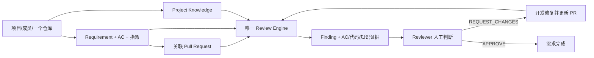
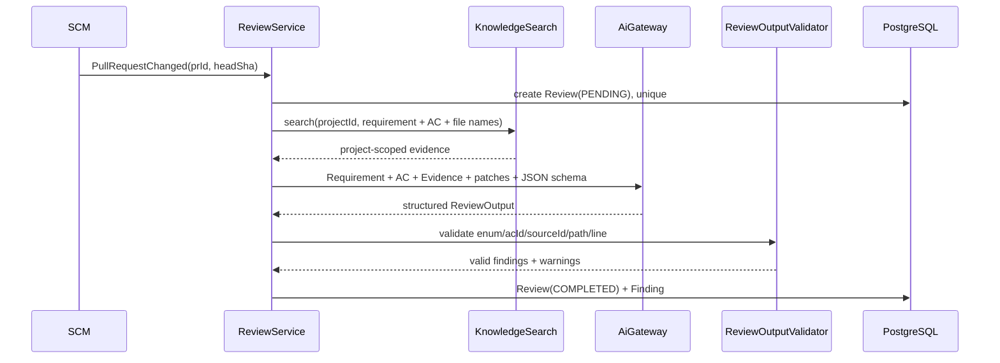

# ForgePilot V2 最终方案候选版

状态：**等待人工评审，禁止实施**。  
形成方式：基于 Legacy 实库审计和第二轮“企业软件架构师 + 高级产品经理 + Staff Engineer”交叉审查。  
本候选版取代第一轮设计中的范围与架构决策。

## A. 产品定义

### A1. 一句话主流程

> **负责人创建并指派带 AC 的需求，开发者提交关联 PR 后，ForgePilot 结合需求、项目知识与 Diff 生成可核验 Finding，Reviewer 据此退回或通过，开发者修复后复审闭环。**

### A2. 产品定位

> **ForgePilot V2 是基于需求与项目知识上下文增强的 AI 代码审查系统。**

项目、成员、需求和知识不是另一套项目管理产品，而是为代码审查提供身份、意图和规则上下文。代码审查是唯一主业务。

建议毕业设计题目：

> **ForgePilot：基于需求与项目知识上下文增强的智能代码审查系统设计与实现**

### A3. MVP 范围

必须有：

- 最小账户、项目成员和三角色：LEADER、DEVELOPER、REVIEWER。
- Requirement、Acceptance Criteria、指派和简化状态机。
- 一个项目一个活动 GitHub/GitLab 仓库，PR/MR 与 Requirement 关联。
- Requirement 附件复用 Project Knowledge 文档，不做双份解析。
- Requirement Quality Check：确定性规则 + 一次结构化 AI 分析。
- Project Knowledge：上传、切片、Embedding、project-scoped pgvector 检索。
- 唯一 Review Engine：Requirement/AC + Knowledge + PR changed-file patch → Finding。
- Finding 人工生命周期和 PR 的 APPROVE/REQUEST_CHANGES。
- 修复后按新 head SHA 产生新 Review，保留前后结果。
- 可复现评测：漏报率、误报率、AC 判定、结构失败、Token 和耗时。

不在 MVP：

- Requirement 聊天助手、聊天历史、SSE。
- Workbench、代码仓库一级菜单、独立知识一级菜单、AI 日志页面。
- 多仓库、多 SCM Connection、通用 Commit 审查、本地 clone/Git CLI。
- 相关代码语义检索、代码向量库、AST/调用图平台。
- Agent、Planner、Tool、Memory、Patch、自动改代码、自动提交。
- RabbitMQ/Kafka/Redis/Outbox、微服务、独立 Sandbox、复杂 Observability。

### A4. 状态简化

Requirement：

```text
DRAFT → READY → IN_DEVELOPMENT → IN_REVIEW → DONE
  └────────────────────────────────────────→ CANCELED
```

`NEEDS_IMPROVEMENT` 删除。质量检查是建议，不是工作流状态；负责人根据报告决定是否将 DRAFT 置 READY。

Finding：

```text
OPEN → CONFIRMED → IN_PROGRESS → FIXED → VERIFIED → CLOSED
  └→ REJECTED       CONFIRMED └→ REJECTED
                           FIXED └→ IN_PROGRESS
```

Review Decision：`PENDING | APPROVE | REQUEST_CHANGES`。AI 置信度、Finding 状态、Review Decision 不互相替代。

## B. 功能架构



### B1. 业务责任边界

| 能力 | 只负责什么 | 明确不负责什么 |
|---|---|---|
| Project | 成员、角色、项目隔离、仓库/知识入口 | Sprint、工时、看板、审批流 |
| Requirement | 需求、AC、指派、质量检查、附件关系 | 通用任务管理、聊天平台 |
| SCM | GitHub/GitLab 凭据、Webhook、PR 元数据和 patch | Review 结论、本地 Git 工作区 |
| Knowledge | 文档、Chunk、Embedding、项目内检索 | Requirement 状态、Review 编排、代码索引 |
| AI | OpenAI-compatible chat/embed 协议和调用记录 | 业务 Prompt、Agent 编排、自动决策 |
| Review | 组装审查上下文、运行唯一引擎、Finding、人工决策 | SCM 凭据管理、知识入库、自动修复 |

### B2. 自动触发与手动重试

SCM 完成 Webhook 验签、PR 同步后发布一个进程内 `PullRequestChanged` 事件。Review 监听该事件并按 `(pull_request_id, head_sha, engine_version)` 幂等创建 Review。

Review 使用有界进程内执行器运行 LLM 调用。Webhook 在保存 PR 后即可返回 202。进程崩溃可能留下 PENDING/FAILED Review，由页面上的“重试”调用同一个 Review Service；不为了掩盖这个边界引入 MQ/Outbox。

自动触发和手动重试不是两个 Engine，只是同一个 `ReviewService.requestReview(...)` 的两个入口。

## C. AI 架构

### C1. 唯一技术入口

`ai` 只提供：

```text
AiGateway.chat(prompt, schema, useCase)
AiGateway.embed(texts, embeddingConfig)
```

它负责 HTTP、认证、超时、一次有限重试、结构化调用元数据、Token/延迟和错误分类。它不知道 Requirement、Finding、Review、Agent 等业务类型。

业务 Prompt 分别归 `requirement` 和 `review`；不建设 Prompt Registry 平台，不共享一个“万能 ContextBuilder”。

### C2. MVP ReviewContext

```text
ReviewContext
├── requirement: title, background, description
├── acceptanceCriteria[]: id, text
├── knowledgeEvidence[]: sourceId, documentId, chunkId, excerpt, score
├── pullRequest: provider, repo, number, baseSha, headSha, title
├── changedFiles[]: path, changeType, providerPatch
└── truncation: skipped/truncated file details
```

删除独立 `relevantCode[]`。MVP 只审查 SCM API 返回的 changed-file patch；不 clone 仓库、不索引代码、不根据 import 或调用图扩张上下文。以后只有评测证明 Diff 上下文不足时，才把相关代码读取作为 P1。

### C3. 单次 Review 流程



AC 覆盖和代码 Finding 在一次结构化输出中完成，不再额外运行一套 Coverage Judge。输出中每条 AC 都必须有 `COVERED | NOT_FOUND | AT_RISK`；模型漏项由 Validator 补为 NOT_FOUND。这样避免“代码审查一次 + AC 判定一次”的双 LLM 职责。

### C4. 证据和安全

- Requirement、文档、PR 标题、代码注释全部是不可信数据，不能改变 system/task 指令。
- Prompt 发送前做敏感信息脱敏和预算裁剪。
- `acId` 必须存在于当前 Requirement。
- `sourceId` 必须存在于本次召回白名单。
- `filePath` 必须存在于 changed files；行号必须落在 patch 可验证范围，无法验证则不输出精确行号。
- Finding 证据保存不可变 excerpt/hash，历史 Review 不受知识文档后续变化影响。
- 非法 JSON 允许一次 format-repair；仍失败则 Review=FAILED，绝不生成“成功空报告”。

### C5. Knowledge 简化

- 一个部署配置一个 Embedding provider/model/dimension。
- `knowledge_chunk.embedding` 是唯一向量存储；无 embedding JSON、无第二 vector table。
- `project_id` 是检索硬过滤条件，不是召回后的内存过滤。
- 保存 embedding_model/version/dimension 只为可追溯与检测错误，不建设在线多版本路由。
- 更换模型是维护操作：停止该项目索引写入、重新生成 chunk embedding、完成后替换；失败保留旧数据。MVP 不做 active version 双轨和无停机迁移。

## D. 数据模型

### D1. 14 张表

| 表 | 核心职责 | 关键约束 |
|---|---|---|
| `user_account` | 本地演示账户 | username unique, password_hash, enabled, session_version |
| `project` | 项目边界 | name, created_by, status |
| `project_member` | 成员与角色 | `(project_id,user_id)` unique；每项目一个 LEADER |
| `requirement` | 需求、指派、状态、最新质量结果 | project_id, assignee_id, quality_json/version/checked_at |
| `acceptance_criterion` | AC | `(requirement_id,seq)` unique |
| `knowledge_document` | 项目知识和需求附件共用内容 | project_id, source_type, text, status, model/version |
| `requirement_attachment` | Requirement 到 KnowledgeDocument 的关系 | `(requirement_id,document_id)` unique |
| `knowledge_chunk` | Chunk 与唯一向量 | project_id, document_id, index, content, metadata, vector, model/version |
| `scm_repository` | 一个项目的活动 provider/仓库/加密凭据 | `project_id` unique；provider、external_id、api_base、encrypted_token/secret |
| `pull_request` | PR/MR 快照与需求关联 | `(repository_id,external_number)` unique；requirement_id nullable |
| `review` | 一个 head SHA 的审查、摘要和 PR Decision | `(pull_request_id,head_sha,engine_version)` unique |
| `finding` | Review 问题当前态 | review/requirement/ac/path/line/evidence/status/assignee/fingerprint |
| `finding_event` | Finding 人工状态与指派审计 | finding_id, actor_id, action, from/to, comment, time |
| `ai_call_log` | 论文评测与故障定位 | project/review/use_case/model/token/latency/status/error |

`scm_connection` 删除并合并进 `scm_repository`，原因是 MVP 一个项目一个活动仓库，不存在连接复用价值。未来出现“一个 installation 管多个仓库”的真实需求时，再通过 Flyway 拆表。

`review_report/review_issue/review_task` 不存在：Review 是报告头和运行记录，Finding 是问题明细。

`review_decision` 不单独建表：同一 head SHA 只允许做一次终局 Decision；REQUEST_CHANGES 后必须有新 head SHA 才能再次 Review。该规则同时避免覆盖历史。若产品未来允许同一 head 多次改判，再通过 ADR 增加 decision history。

### D2. 项目隔离

- 所有项目业务表直接保存或可通过强 FK 路径确定 project_id。
- 查询 Repository 必须接受 projectId，禁止只按裸 id 查询后再补权限判断。
- Knowledge vector query 必须在 SQL 中带 project_id。
- 集成测试固定包含 A 项目用户猜测 B 项目 requirement/document/review/finding id 的攻击用例。

## E. 后端 Package 设计

### E1. 顶层包

```text
com.forgepilot
├── common        # API error、paging、clock、纯安全工具
├── auth          # 登录、Cookie/Session、Spring Security
├── project       # Project、Member、Role、ProjectAccessService
├── requirement   # Requirement、AC、附件关系、质量检查
├── scm           # Repository、PR、Webhook、GitHub/GitLab provider
├── knowledge     # Document、Chunk、ingestion、search
├── ai            # provider-neutral chat/embed gateway
└── review        # Review Engine、Finding、人工决策
```

不再有独立 `finding`。也禁止重新出现 `agent/patch/mq/rag/repo/pullrequest/context/assistant` 顶层包。

### E2. 不强制四层

每个 feature 只创建实际需要的子包，例如：

```text
review
├── ReviewController
├── ReviewService
├── ReviewRepository
├── Review
├── Finding
├── FindingRepository
├── FindingLifecycleService
├── ReviewContextBuilder
├── ReviewEngine
└── ReviewOutputValidator
```

只有 SCM 因 provider 差异建立 `scm.github`、`scm.gitlab`；只有 AI 因外部协议建立 `ai.openai`。不为追求目录对称创建空 domain/application/infrastructure 层。

### E3. 单向依赖

```text
common ← auth
common ← project
common ← ai
common, project ← scm
common, project, ai ← knowledge
common, project, knowledge, ai ← requirement
common, project, scm, knowledge, requirement, ai ← review
```

关键规则：

- 业务模块不依赖 auth；Controller 从登录上下文取得 `userId` 后传入业务 Service。
- SCM 不调用 Review。SCM 发布自己定义的 `PullRequestChanged`，Review 依赖 SCM contract 并监听。
- Requirement 可调用 Knowledge 创建文档，Knowledge 永远不知道 Requirement。
- Review 是唯一跨 SCM/Requirement/Knowledge/AI 编排的模块。
- 跨 feature 禁止直接注入对方 Repository；使用该 feature 的 Service/Query facade。
- ArchUnit 验证顶层 cycle=0、禁止包不存在、Controller 不直连跨模块 Repository。

## F. 前端信息架构

MVP 登录后的一级导航只有三个：

1. **项目**：项目、成员、SCM 仓库、项目知识。
2. **研发需求**：需求/AC、指派、质量检查、附件、关联 PR。
3. **代码审查**：PR Review、AC 覆盖、Finding、人工决策和复审历史。

```text
/projects
/projects/:id/members
/projects/:id/settings       # SCM + Knowledge
/requirements
/requirements/:id
/reviews
/reviews/:id
```

Workbench、Knowledge、Repository、Metrics、Agent、Patch、AI Logs 均不做一级页面。知识检索测试不面向普通用户；管理员只需看到文档状态和失败原因。

## G. Legacy → V2 最终迁移判断

### G1. 允许迁实现的 KEEP 白名单

| Legacy 资产 | 最终判断 | 说明 |
|---|---|---|
| `KnowledgeUploadValidator` | KEEP with adaptation | 保留 bounded read、strict UTF-8、NUL/filename 规则；替换异常类型 |
| `PromptSanitizer` | KEEP with tests | 作为 best-effort 脱敏，不宣称能发现所有 Secret |
| GitHub/GitLab WebhookVerifier | KEEP | HMAC/Token 常量时间比较与 raw-byte 契约不变 |
| `OutboundUrlPolicy` | KEEP with adaptation | 保存安全算法与测试；V2 仅用于 SCM API base/回写 URL |
| `FindingLifecycle` | KEEP | 状态边与目标一致，归入 review |
| `evaluation/score.py` 核心匹配/统计 | KEEP TOOL | 保留确定性 1:1、漏报/误报分开、notRun 纪律，适配 V2 JSON |
| `demo-repos` 与评测 fixture | KEEP DATA | 删除 Agent/Patch 运行字段，不改缺陷真值与诚实边界 |

### G2. 从 KEEP 降级

| Legacy 资产 | 最终判断 | 降级原因 |
|---|---|---|
| `RequirementStatus` | REWRITE | 删除 NEEDS_IMPROVEMENT，质量不驱动状态 |
| `RequirementRuleChecker` | REWRITE, keep rules/tests | 旧实体/DTO 耦合；中文启发式需版本化而非原样神化 |
| `RequirementCheckParser` | REWRITE, keep strictness tests | 新 Quality Schema 不同 |
| `NormalizedPullRequestEvent/Snapshot` | REWRITE, keep contract fixtures | 删除 clone/Agent publication 假设 |
| `GitInputValidator` | DROP implementation / REFERENCE tests | 不做本地 clone 和用户输入 Git ref |
| `DiffSplitter` | REWRITE | 改为对 provider `ChangedFile` 分片；旧实现会按 maxFiles 丢文件 |
| `FindingCandidate/Evidence` | REWRITE | 新证据必须绑定 review/requirement/ac/source whitelist |
| `FindingDeduplicator` | REWRITE | 旧算法 lower-case path 且缺 head/ac 语义 |
| `AuthCookieService` | REWRITE | 代码小、旧配置绑定，保留安全属性测试即可 |

### G3. 不能随整包 DROP 的成熟资产

- `ScmProviderContractTest`：删掉 Agent ReviewPublication 部分，保留 GitHub/GitLab 归一化 contract fixture。
- Webhook 验签、重放、未知 installation、验签后才记录的测试场景。
- Knowledge 上传边界、跨项目 retrieval、Embedding dimension/version 不匹配测试。
- Requirement Rule 与 Parser 的严格拒绝特征测试。
- Coverage Judge 中“AC 全量补齐、未知 acId 拒绝、伪造文件证据降级”的测试语义；实现并入 `ReviewOutputValidator`，不保留第二 Judge。
- `KnowledgeDocumentStateService` 的短事务失败状态思想。
- Compose 中 healthcheck、日志轮转、secret 必填和仅本机暴露管理端口的部署经验。

### G4. 明确 DROP

Agent/Step/Planner/Orchestrator、Patch、MQ/Outbox、Legacy Review/Projection、Finding 自动 gate 权重、第二 AI runtime、local clone/Git CLI 主线、向量双写、运行时 DDL、model-service、sandbox-runner、完整 OTel/Prometheus/Grafana、旧 Flyway、前端 Agent/Patch/Metrics/Workspace。

## H. 实施顺序候选（仍未批准）

| Phase | 纵向目标 | 退出条件 |
|---:|---|---|
| 0 | 冻结词汇、状态、14 表、依赖和 KEEP 白名单 | 候选版经人工批准；无产品阻塞问题 |
| 1 | 绿地骨架、V1、ArchUnit、Postgres/pgvector | 空库启动；cycle=0；禁止包测试通过 |
| 2 | Auth + Project/Member | 三角色和跨项目越权测试通过 |
| 3 | Requirement/AC/指派/附件关系 | 无 AI 也能完成需求主流程 |
| 4 | AI Gateway + Knowledge | project-scoped 检索、上传边界、模型配置测试通过 |
| 5 | GitHub SCM + PR patch | Webhook 验签/幂等、PR 同步，不执行第二引擎 |
| 6 | Requirement Quality + 唯一 Review Engine | 一次输出 AC coverage + Finding，证据校验通过 |
| 7 | Finding/PR 人工闭环 + 三页面 UI | REQUEST_CHANGES→新 head→复审→APPROVE 可演示 |
| 8 | GitLab Adapter + 评测/答辩 | 同一 contract 通过；质量数字可由原始结果重算 |

GitLab 放在 GitHub 主线跑通之后，用来验证 Adapter 不是为了抽象而抽象。Requirement Assistant 作为 P1，不在上述毕业设计核心 Phase 内。

## I. 技术组件必要性与风险

### I1. 每个组件对应的真实需求

| 技术组件 | 对应业务需求 | 删除后影响 |
|---|---|---|
| Spring Boot/MVC | 业务 API、Webhook、Review 编排 | 无后端产品 |
| Spring Security | 三角色和人工决策可信边界 | 只能做单用户算法 Demo |
| JPA + PostgreSQL | 项目、需求、PR、Review、Finding 状态与审计 | 无业务闭环 |
| Flyway | 干净 V1 和可重复部署 | 数据结构不可复现 |
| pgvector | 项目规范的语义检索 | 退化为需求+Diff 审查 |
| OpenAI-compatible Chat | Requirement Quality 与 Review | 无 AI 分析 |
| OpenAI-compatible Embedding | Knowledge retrieval | 只能全量拼文档或关键词搜索 |
| GitHub/GitLab API | 真实 PR/MR 和 patch | 退化为手工粘贴 Diff |
| Vue 3 | 三角色可操作闭环 | 只有接口 Demo |
| ArchUnit | 防止重建旧循环依赖 | 短期可运行，长期高复发风险 |
| Testcontainers | 验证真实 PostgreSQL/pgvector/约束 | H2 无法证明关键隔离与向量行为 |
| Docker Compose | 答辩环境可重复启动 | 环境搭建不可复现 |
| 有界进程内执行器 | Webhook 不等待长 LLM | 只能同步阻塞；无需 MQ |

不引入 Resilience4j Circuit Breaker、消息队列、分布式锁、服务发现、API Gateway、独立向量服务或 APM 平台。HTTP timeout + 一次有限 retry + Review FAILED/人工 retry 足够覆盖当前故障事实。

### I2. 主要风险

- `scm → review` 反向依赖复发：用事件 contract + ArchUnit 阻断。
- Requirement 与 Knowledge 双向依赖：附件关系只由 Requirement 保存，Knowledge 不反查业务。
- AI Gateway 变成通用 Agent 工具箱：接口只允许 chat/embed，不暴露 tool loop。
- Review 包变成新“大泥球”：它可以编排但不能访问外模块 Repository；Finding 留在包内是内聚，不是无限吸收功能。
- 大 PR 丢文件：ChangedFile 分片必须生成 coverage manifest；未审查文件显式展示，不能静默截断。
- 进程内任务丢失：Review 状态可见、幂等 retry；如果真实压测证明不可接受，再单独评估持久队列。
- Embedding 变更：V1 单配置；跨维度切换必须维护窗口和迁移，不做隐式混用。
- Prompt injection/伪造证据：输入不可信标记、source 白名单和输出回查。
- 毕业设计范围回弹：P1 清单不得在核心 E2E 完成前实施。

## J. 最终结论

第二轮候选版比第一稿进一步删除了：独立 Finding 模块、强制四层 package、多仓库/connection 分离、Requirement Assistant MVP、在线 Embedding 双版本、相关代码检索、本地 Git、两个 AI 判定阶段、两个前端一级菜单以及多项错误 KEEP。

最终核心只剩一条不可替代的因果链：

> **需求与 AC 说明“应该做什么”，项目知识说明“在本项目里应该怎么做”，PR Diff 说明“实际改了什么”，ForgePilot 比较三者并生成可核验证据，最终由人决定是否通过。**

如果后续任何新增模块无法说明它改变了这条链上的哪个用户结果，就不进入 ForgePilot V2。
