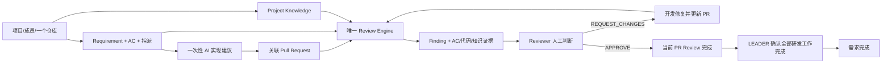

# ForgePilot V2 产品需求

状态：**成员目录、多角色与 SCM 多身份（2026-08-24）**。本文是**产品权威**：定位、角色、范围、流程与验收标准。Phase 0–8、D017 与 D018 的历史闸门保持有效；D020 只扩展人员和 SCM 身份管理。

技术规范（模块、19 表、依赖、运行边界）见 [ARCHITECTURE.md](./ARCHITECTURE.md)，本文不复述。

---

## 1. 定位与价值

> **ForgePilot V2 是围绕需求驱动 PR 审查建设的轻量级 AI 研发协作平台。**

毕业设计题目：**ForgePilot：基于需求与项目知识上下文增强的智能代码审查系统设计与实现**。

项目、成员、需求和知识用于建立真实研发责任与上下文；PR 审查是旗舰能力，需求检查和一次性实现建议分别服务开发前与开发中。系统不扩张为 Jira、通用聊天平台或自动编码 Agent。

核心价值：负责人与 Reviewer 不再只看到通用代码建议，而能看到代码变更与 Requirement、AC、项目规范之间的**可追踪差异**，并由人完成退回、修复、复审与通过。

## 2. 主流程

> 负责人创建并指派带 AC 的需求，开发者获得一次性 AI 实现建议并提交关联 PR；ForgePilot 结合需求、项目知识与 Diff 生成可核验 Finding，Reviewer 据此退回或通过，开发者修复后复审，最终由 LEADER 确认需求完成。



任何不能服务这条因果链的能力，默认不进入 MVP。

## 3. 角色与权限

每个项目**恰有一个 LEADER**。同一成员可同时拥有 `LEADER / DEVELOPER / REVIEWER` 中的多个角色，权限取角色能力并集；Leader 转移使用独立动作。不设独立 OWNER。AI 只生成分析结果，**不改变任何业务状态**。

| 动作 | LEADER | DEVELOPER | REVIEWER |
|---|:--:|:--:|:--:|
| 创建项目、管理成员与角色 | ✅ | ❌ | ❌ |
| 配置 SCM 仓库、上传项目知识 | ✅ | ❌ | ❌ |
| 验证、标注和撤销自己的 SCM 身份 | ✅ | ✅ | ✅ |
| 为项目选择自己的兼容 SCM 身份 | ✅ | ✅ | ✅ |
| 严格项目批准/拒绝成员待审身份绑定 | ✅ | ❌ | ❌ |
| 创建/编辑需求与 AC | ✅ | ❌ | ❌ |
| 上传 `.txt/.md` 需求文档 | ✅ | ❌ | ❌ |
| 阅读/下载需求文档、导出结构化需求 | ✅ | ✅ | ✅ |
| 运行需求质量检查 | ✅ | ❌ | ❌ |
| 需求 DRAFT → READY、指派开发 | ✅ | ❌ | ❌ |
| 生成当前需求的一次性 AI 实现建议 | ✅ | 仅被指派需求 | ❌ |
| 修改 PR↔需求关联 | ✅ | 仅本人 PR，且当前 head 尚无任何人工终局 Decision | ❌ |
| 触发/重试 Review（含版本过期后的重审） | ✅ | 仅本人 PR | ✅ |
| Finding 确认 / 拒绝 | ✅ | ❌ | ✅ |
| Finding 认领、标记已修复 | ❌ | ✅ | ❌ |
| Finding 验证通过 / 打回 | ✅ | ❌ | ✅ |
| Review 终局 APPROVE / REQUEST_CHANGES | ✅ | ❌ | ✅ |
| 取消需求 | ✅ | ❌ | ❌ |

跨项目一律不可见、不可操作。

## 4. MVP 范围

### 必须有

- 带显示名、用户名和平台 ID 的最小账户；成员目录支持搜索、原子批量添加与三角色任意非空组合。
- 每个账户可验证多个 GitHub/GitLab 身份并填写标签和用途；每个项目成员同时最多一个活动绑定。
- Requirement、AC、指派与简化状态机。
- 一个项目一个活动 GitHub/GitLab 仓库；PR/MR 与 Requirement 关联。
- Requirement 附件复用 Project Knowledge 文档，不做双份解析；首版只允许 LEADER 上传 `.txt/.md`，所有项目成员可阅读和下载。
- Requirement 详情并列结构化 Revision 与需求文档；结构化内容可导出 Markdown，两者不自动同步或映射。
- Requirement Quality Check：确定性规则 + 一次结构化 AI 分析。
- Requirement Implementation Guidance：基于 Requirement、AC 与项目知识生成一次性实现清单、相关规则和风险提示，不保存对话。
- Project Knowledge：上传、切片、Embedding、项目内检索。
- 六入口产品界面：工作台、项目、研发需求、项目知识、仓库接入、代码审查；工作台只读组合真实业务数据。
- Knowledge 与需求附件展示真实切片、Embedding Profile、维度和语义索引状态，不展示原始向量。
- 唯一 Review Engine：Requirement/AC + Knowledge + PR patch → Finding。
- Finding 人工生命周期 + PR 的 APPROVE/REQUEST_CHANGES。
- 修复后按新 head SHA 产生新 Review，保留前后结果。
- 可复现评测：漏报率、误报率、AC 判定、结构失败、Token、耗时。

### 不做

- 通用聊天助手、聊天历史、SSE、多轮记忆。
- 通用编排工作台、代码仓库浏览器、AI 日志或通用 Assistant 一级菜单。
- 多仓库、多 SCM Connection、通用 Commit 审查、本地 clone/Git CLI。
- 相关代码语义检索、代码向量库、AST/调用图。
- Agent、Planner、Tool、Memory、Patch、自动改代码/提交。
- MQ/Redis、微服务、独立 Sandbox、复杂 Observability。

后置能力（核心 E2E 完成前不得实施）：多轮 Requirement Assistant、多仓库、相关代码读取、报告导出、高级监控。D017 只批准只读项目工作台，不批准编排、聊天或自动执行。

## 5. 业务状态

### Requirement

持久状态（[D011](./DECISIONS.md#d011)）：

```text
DRAFT → READY → IN_DEVELOPMENT → DONE
  └────────────────────────────→ CANCELED
```

`DRAFT → READY` 由 LEADER 确认；`READY → IN_DEVELOPMENT` 与**首次指派**同事务完成，后续更换负责人不再改变状态；`→ DONE` 由 LEADER 确认全部关联工作完成。**AI、Webhook、PR、Review 一律不得推进这些状态。**

无 `NEEDS_IMPROVEMENT`：**质量检查是建议，不是工作流状态**，也不能自动置 READY。
无 `IN_REVIEW`：评审进展是**只读派生量** `review_activity`，按关联 PR 的**当前 head + 当前 Diff fingerprint + 当前需求版本**计算，不落表。单 PR 映射如下：

| 条件 | Activity |
|---|---|
| 当前关联下没有匹配 head/fingerprint/revision 的 Review | `REVIEW_REQUIRED` |
| 当前 Review 执行失败 | `FAILED` |
| 当前 Review 的 Decision 为 `REQUEST_CHANGES` | `CHANGES_REQUESTED` |
| 当前 Review 正在 RUNNING，或已 COMPLETED 但仍等待人工 Decision | `REVIEWING` |
| 当前 Review 为 PENDING | `PENDING` |
| 当前 Review 的 Decision 为 `APPROVE` | `APPROVED` |

Requirement 没有关联 PR 时为 `NO_PR`。多 PR 聚合先让 `FAILED`、`CHANGES_REQUESTED` 两类风险状态依次占优；否则全部子状态相同就返回该状态，全部 `APPROVED` 才返回 `APPROVED`，其余组合返回 `MIXED` 并在 UI 展示各状态计数。需求状态与评审活动并列展示，不得合并。

READY 后正文与 AC 锁定；修改由 LEADER 创建新的不可变 Revision 并填写变更原因，旧 AC 永久保留。DRAFT 阶段的 Revision 1 可原地编辑，`DRAFT → READY` 同事务冻结——"不可变"指**已发布的 Revision**。需求版本变更**不自动重审**，关联 PR 显示"审查已过期"，由人工按上表权限触发。需求质量检查结果归属具体 Revision，DRAFT 期间正文一改即失效。

### Finding

```text
主链：OPEN → CONFIRMED → IN_PROGRESS → FIXED → VERIFIED → CLOSED
旁路：OPEN → REJECTED；CONFIRMED → REJECTED
打回：FIXED → IN_PROGRESS（复验不通过）
重开：REJECTED → OPEN（**仅** continuity=SUPPRESSED 的继承驳回项，须留审计）
终态：CLOSED；REJECTED（普通驳回不可逆）
```

该状态机是**人工处理生命周期**，与跨 Review 血缘 `continuity`（`NEW / PERSISTING / SUPPRESSED`，[D009](./DECISIONS.md#d009)）正交，两者不得混入同一字段或同一 UI 标签。继承而来的抑制项以 `status=REJECTED + continuity=SUPPRESSED` 落库；被重新打开后 `continuity` 仍保留 `SUPPRESSED`（血缘事实不因当前状态改变而消失），并回到主列表正常显示。

### Review Decision

`PENDING | APPROVE | REQUEST_CHANGES`。**AI 置信度、Finding 状态、Review Decision 三者不互相替代**，UI 上必须分开呈现。
终局 Decision 只能从 `PENDING` **写入一次**，目标 Review 必须已完成，且 head、Diff fingerprint 与需求版本均等于 PR 当前值；同一 head 出现 REQUEST_CHANGES 后必须有新 head SHA 才能再次 APPROVE——**改 Base、需求关联、需求版本或重新同步 Diff 都不能解除该闸门**。并发 APPROVE/REQUEST_CHANGES 只有一个请求可以成功。

## 6. 关键产品规则

| # | 规则 | 依据 |
|---|---|---|
| P1 | PR 关联需求：分支名/标题解析 `REQ-<n>` 优先，页面下拉框可改可清除；LEADER 始终可改，本人 PR 的 DEVELOPER 在当前 head 尚无人工终局 Decision 时可改；解析失败不阻断入库，Review 标记"未关联需求" | [D007](./DECISIONS.md#d007) |
| P2 | 一个 Requirement 可有多个 PR；一个 PR 至多关联一个 Requirement | [D004](./DECISIONS.md#d004) |
| P3 | 需求附件只在所属需求的 AI 场景可见；跨需求共享必须显式提升为项目知识 | [D005](./DECISIONS.md#d005) |
| P4 | Review 身份 = (PR, head SHA, Diff fingerprint, 需求版本)；当前有效性还须匹配 PR 当前输入；终局 Decision 闸门只认 (PR, head SHA)；Decision 写一次；FAILED 重试复用同一行，COMPLETED 永不覆盖 | [D003](./DECISIONS.md#d003) |
| P5 | 大 PR 分批审查但只产出一份报告；未审查文件必须显式呈现，禁止静默截断 | [D002](./DECISIONS.md#d002) |
| P6 | AI 返回非法结构时 Review 判定失败，**绝不生成"成功空报告"** | ARCHITECTURE §3.5 |
| P7 | 人工决策全部留痕（actor、时间、备注），可追溯 | ARCHITECTURE §2.1 |
| P8 | Review 保存审查时的 requirement_id、requirement_revision_id 与不可变上下文快照；历史结果不得通过 PR 当前关联反查语义 | ARCHITECTURE §2.1/3.5 |
| P9 | 单个 PR APPROVE 只结束当前 Review；Requirement DONE 必须由 LEADER 在确认全部关联工作完成后执行 | [D004](./DECISIONS.md#d004) |
| P10 | 上一轮已驳回且源码证据与权威判定依据均未变的 Finding，本轮自动抑制、不要求重复驳回；抑制不跨 PR，且不得自动认定"本轮未报告 = 已修复" | [D009](./DECISIONS.md#d009) |
| P11 | "本人 PR" 按 Provider + 实例 + 稳定外部用户 ID 与成员当前活动绑定判定，**禁止按用户名授权**；身份由本人用一次性 Token 向 Provider 验证，Token 不落库；项目默认自动生效，可由 LEADER 开启严格审批 | [D020](./DECISIONS.md#d020) |

## 7. 验收标准

### Phase 0（已完成并批准）

- [x] Legacy backend/frontend/deploy/evaluation/demo/docs 已实际扫描并逐项核实。
- [x] 核心流程可用一句话讲清；每个 MVP 模块通过"删除后产品是否成立"测试。
- [x] Finding 保持在 review 内；多轮 Assistant、相关代码检索、多仓库和强制四层已删除。
- [x] 数据模型收敛为 16 张表，依赖单向且无环。
- [x] 争议决策全部落为 D001–D011。
- [x] 文档收敛为单一事实源，无跨文档重复定义。
- [x] R2.3 文档基线通过一致性审核；Phase 1 已获授权进入任务级规划，具体实现仍须确认计划并执行 `task.py start`。

### 产品 E2E（Phase 7 退出标准，R2.5 复核）

自动化覆盖（后端 317 个测试、前端 35 个测试）证明的部分记 `[x]`；只有人工浏览器验收能证明的部分保持 `[ ]` 并注明，不因为“阶段已通过”就一律打勾。

- [x] LEADER 建项目、加成员、配仓库、传知识、写需求与 AC、指派开发。
- [x] LEADER 可按显示名、用户名或平台 ID 搜索并批量添加成员；一个成员可有多个角色，权限按能力并集判定。
- [x] 成员可管理带标签/用途的多个 SCM 身份并为项目选择自己的身份；严格项目由 LEADER 批准后才参与“本人 PR”映射。
- [x] 被指派开发者可生成一次性实现建议，输出实现清单、相关规则和风险提示，不产生聊天会话。
- [x] 开发者提交 `feat/REQ-<n>-*` 分支 PR，系统自动关联需求并产生 Review。
- [x] Review 呈现 AC 覆盖判定与带证据的 Finding（后端产出与校验有测试覆盖）。
- [ ] 证据可点击回溯到 AC/知识/代码行——交互存在且有 jsdom 断言，**真实浏览器点击闭环仍为人工验收**。
- [x] Reviewer 确认部分 Finding 并 REQUEST_CHANGES；开发者修复推送新 head SHA。
- [x] 新 Review 自动产生，历史 Review 完整保留；上一轮已驳回且源码证据与权威判定依据均未变的 Finding 在新 Review 中显示为已抑制，无需重复驳回。
- [x] Reviewer APPROVE 只完成当前 Review，LEADER 确认后再将需求置 DONE。
- [x] 需求状态与派生的评审活动在页面上分开呈现，互不污染。
- [x] Requirement Revision 或 PR Diff 变化后显示 `REVIEW_REQUIRED`，旧 Review 不可对当前输入作终局决定。
- [x] A 项目用户无法看到或操作 B 项目的任何资源。
- [x] 同项目 A 需求的私有附件不会进入 B 需求的 Guidance 或 Review；公共项目知识和当前需求附件可以召回。
- [x] 项目成员可在需求详情阅读/下载 `.txt/.md` 文档，并将结构化 Revision 导出为 Markdown；只有 LEADER 可上传。
- [x] 用户可在独立 Knowledge/仓库页面完成上传、查看向量索引状态、读取并编辑安全的 SCM 配置；任何响应不回显凭据或原始向量。
- [x] 工作台以真实数据展示项目脉搏和“质量检查 → 知识增强 Guidance → 唯一 Review Engine”的 AI 能力链，不伪造评分或运行状态。
- [ ] 1440 / 768 / 390 三档宽度与 `prefers-reduced-motion` 两种模式的视觉与响应式验收——**人工验收**，清单见 `frontend/MANUAL-ACCEPTANCE.md`。

### 未兑现的产品规则（R2.5）

- **P7 的适用范围按 [D013.3](./DECISIONS.md#d013) 收窄**：需求状态转换（DRAFT→READY、指派、CANCELED、DONE）在 MVP 不单独留痕。这是明确接受的缺口，不是遗漏。

P1 曾长期只实现一半（关联修改只允许 LEADER）。R2.5 已补齐作者那一半：PR 作者在本 head 尚无任何人工终局 Decision 时可以纠正关联，作者身份按项目级稳定外部 id 判定；闸门关闭时返回 409 并说明推新 commit 即可重开。见 [D016.2](./DECISIONS.md#d016) 的执行状态。

## 8. 风险与边界声明

- 进程内 Review 执行**不提供**消息队列级持久性；系统必须在 PR 同步事务内先持久化 PENDING，提交后才启动执行器，并通过轻量 reconciliation 恢复已落库但未执行/停滞的任务。每次执行使用 attempt/token fencing，过期 Worker 不得覆盖新结果；reconciliation 不得补建缺失 Review。
- 一个项目一个仓库是 MVP 约束；出现真实多仓库需求后再设计。
- **仓库产生 PR 后不可原地更换**：provider、规范化 SCM instance identity 与外部仓库 ID 冻结；凭据/Webhook Secret 可更新，API 地址只能在验证仍指向同一实例后更新。确需更换仓库或实例须新建项目（[D010](./DECISIONS.md#d010)）。
- **PostgreSQL 最低版本为 15**，来自复合外键列级 `ON DELETE SET NULL` 与 `UNIQUE NULLS NOT DISTINCT` 两处不可替代的语法。
- Embedding 换 Profile 需维护窗口与 reindex，**不承诺**无停机切换。
- GitHub 先跑通主线，GitLab 后验证同一 contract，用以证明 Adapter 的实际价值。
- 评测语料为**人工构造的演示缺陷**，非真实企业缺陷，论文中须诚实说明；且 holdout 仅 12 例，结论必须给出置信区间或明确的不确定性说明，不得把小样本上的差值当作强证据。
